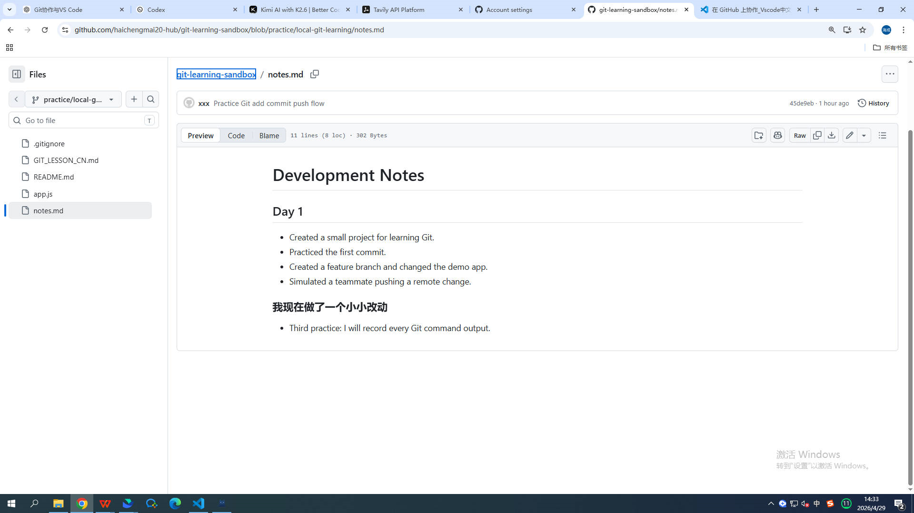
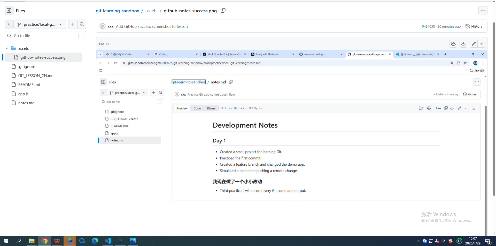
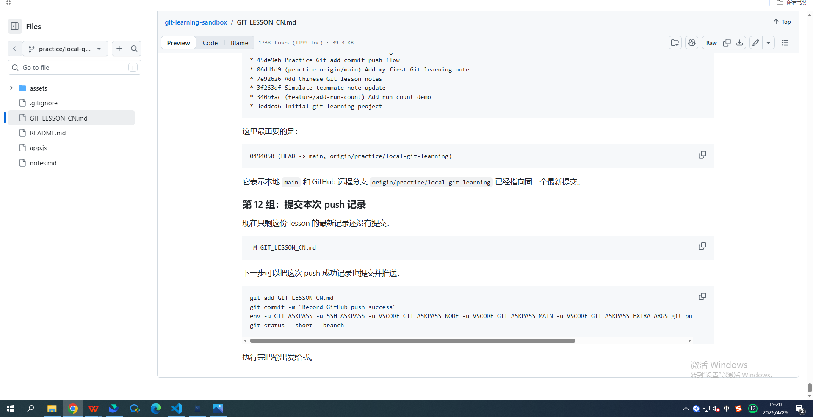
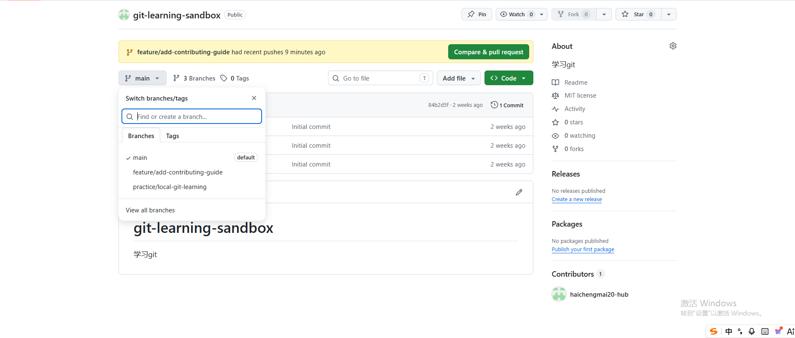
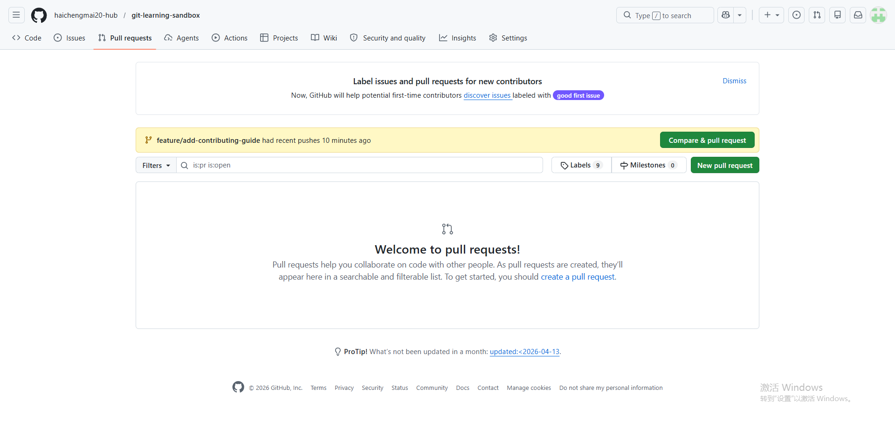
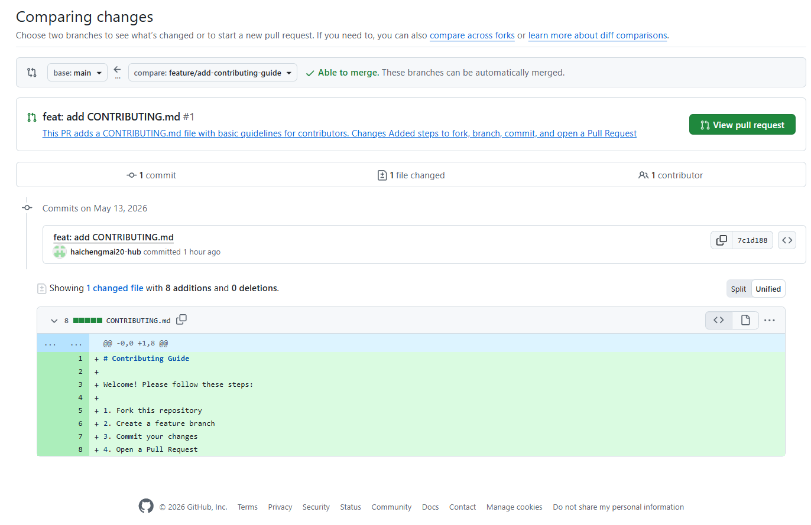
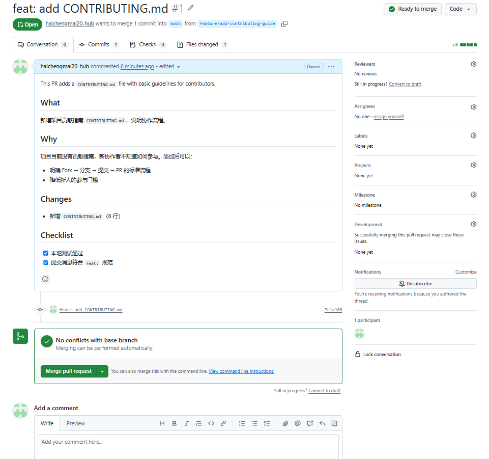

# Git 互动练习课：从修改文件到 push

## 文档结构

```
命令速查表（开头，9 个场景 + 状态标记速查）
├── 场景 1：日常提交流程
├── 场景 2：查看与理解
├── 场景 3：撤销与回退
├── 场景 4：临时保存现场
├── 场景 5：后悔药
├── 场景 6：GitHub 认证与远程
├── 场景 7：合并后清理
├── 场景 8：冲突处理
└── 场景 9：Fork 工作流

背景 & 基础概念（第 0-3 节）

阶段一：基础提交流程（改文件 → add → commit → push）
├── 确认环境与状态
├── 修改文件并查看 diff
├── git add — 暂存文件
├── git commit — 创建本地提交
├── git push — 推送到 GitHub
└── push 到 GitHub 新分支

阶段二：GitHub 远程实战（认证、推送、远程分支）
├── 修复 push 认证失败
├── 创建 Fine-grained PAT 并成功 push
├── 理解远程仓库的三个层次
├── 模拟队友 push — fetch + merge
├── 分支名不一致时的 push
└── 提交并推送学习记录

阶段三：日常高频操作（diff、撤销、暂存、回退）
├── 概览
├── 练习任务总览
├── 重新连接 GitHub
├── 练习：git diff vs git diff --staged
├── 练习：git restore --staged 撤销 add
├── 练习：git stash 临时保存现场
└── 练习：git reset --soft 撤销 commit

阶段四：GitHub 协作开发（分支、PR、代码审查）
├── 概念：为什么不能直接在 main 上开发？
├── 练习 1：创建功能分支并开发
├── 练习 2：推送功能分支到 GitHub 并创建 Pull Request
├── 练习 3：合并后清理——同步 main、删除功能分支
└── 练习 4：代码审查——在 PR 里评论、修改、追加提交

阶段五：合并冲突处理（最常遇到的协作难题）
├── 概念：冲突是怎么产生的？
├── 练习 1：本地合并冲突——两分支改同一文件
├── 练习 2：PR 里的冲突——GitHub 提示 Conflict，本地解决后推送
└── 练习 3：冲突标记详解——手动解决冲突的完整流程

阶段六：Fork 工作流（参与别人的项目）
├── 概念：Fork vs Branch——什么时候用哪个？
├── 练习 1：Fork 仓库 → 克隆 Fork → 建功能分支 → PR 回原仓库
├── 练习 2：同步 Fork——保持你的 Fork 和上游仓库一致
└── 练习 3：upstream 与 origin 的区别

阶段七：高级操作（按需学习）
├── 练习 1：git rebase — 交互式整理提交历史
├── 练习 2：git cherry-pick — 挑选特定提交
├── 练习 3：git tag — 版本标签与发布
└── 练习 4：git bisect — 二分查找引入 bug 的提交
```

## 命令速查表

### 场景 1：日常提交流程

```bash
git status --short --branch    # 查看当前状态和分支
git diff                       # 看工作区改了什么（还没 add 的）
git diff --staged              # 看暂存区有什么（add 了还没 commit 的）
git add <file>                 # 暂存文件
git commit -m "消息"           # 提交
git push origin HEAD:<远程分支>  # 推送到 GitHub
```

### 场景 2：查看与理解

```bash
git status --short --branch    # 两列状态：暂存区 | 工作区
git diff                       # 工作区 vs 暂存区
git diff --staged              # 暂存区 vs HEAD（最近一次提交）
git log --oneline --graph --decorate --all -10  # 提交历史
git remote -v                  # 查看远程仓库
```

### 场景 3：撤销与回退

```bash
git restore --staged <file>    # 撤销 add（文件内容不变，安全）
git restore <file>             # 丢弃工作区修改（⚠️ 会丢内容）
git reset --soft HEAD~1        # 撤销最近一次 commit，修改回到暂存区
git reset --mixed HEAD~1       # 撤销 commit + add，修改回到工作区（默认）
git reset --hard HEAD~1        # 撤销 commit + add + 工作区（⚠️ 全丢！）
```

### 场景 4：临时保存现场

```bash
git stash push -m "备注"       # 把当前改动藏起来，工作区变干净
git stash list                 # 查看所有 stash
git stash pop                  # 恢复最新 stash 并删除
git stash apply                # 恢复最新 stash 但保留（更安全）
git stash drop                 # 手动删除一条 stash
```

### 场景 5：后悔药

```bash
git reflog --date=local -20    # 查看所有操作历史，找回丢失的提交
git reset --hard <哈希>        # 回到某个历史提交（⚠️ 会丢当前改动）
```

### 场景 6：GitHub 认证与远程

```bash
git remote -v                  # 查看远程仓库
git fetch origin               # 下载远程信息（不合并）
git push -u origin main:<分支> # 推送并设置跟踪
# HTTPS 认证失败时用：
env -u GIT_ASKPASS -u SSH_ASKPASS -u VSCODE_GIT_ASKPASS_NODE \
    -u VSCODE_GIT_ASKPASS_MAIN -u VSCODE_GIT_ASKPASS_EXTRA_ARGS \
    git push origin HEAD:<远程分支>
```

### 场景 7：合并后清理

```bash
git checkout main              # 切回主分支
git pull --rebase origin main  # 拉取远程 main 的合并结果
git branch -d feature/xxx      # 删除本地功能分支（已合并的）
git push origin --delete feature/xxx  # 删除远程功能分支
git branch -a                  # 查看所有分支，确认已清理
```

### 场景 8：冲突处理

```bash
git merge feature/xxx          # 合并分支（可能冲突）
# 冲突时：打开文件，找到 <<<<<<< 标记，手动选择保留内容
# 修改后：
git add <冲突文件>
git commit                     # 完成合并提交
# 放弃合并（回到合并前）：
git merge --abort
```

### 场景 9：Fork 工作流

```bash
git remote add upstream <原仓库URL>  # 添加上游仓库
git fetch upstream                    # 拉取上游更新
git merge upstream/main               # 合并上游更新到本地
git push origin main                  # 推送到你的 Fork
```

### 状态标记速查

```text
 M file   工作区有修改，未暂存（add 之前）
M  file   暂存区有修改，工作区干净（add 之后）
MM file   暂存区有修改，工作区又有新修改（add 后又改了）
A  file   新文件已暂存
?? file   未跟踪文件
```

---

## 0. 背景

我们现在在一个专门用来学习 Git 的练习仓库里：

```text
/home/ps/dcr/claudecode/claudecode_sourcecode1/git-learning-sandbox
```

外层目录：

```text
/home/ps/dcr/claudecode/claudecode_sourcecode1
```

本身也是一个 Git 仓库。为了避免把学习内容误提交到源码项目里，本课所有命令都必须在
`git-learning-sandbox` 目录里执行。

这次我们采用互动方式：

1. 我先写清楚当前要做什么。
2. 你在终端执行命令。
3. 你把终端输出发给我。
4. 我根据真实输出继续更新这份 lesson。

## 1. 本课使用哪些文件

本课主要使用这几个文件：

```text
README.md
GIT_LESSON_CN.md
notes.md
app.js
.gitignore
```

其中最重要的是：

```text
notes.md
```

我们会把 `notes.md` 当作练习修改的文件。原因是它很简单，不涉及程序运行，适合用来观察
Git 的状态变化。

这份文件：

```text
GIT_LESSON_CN.md
```

是课程记录文件。你每完成一步并把终端输出发给我，我会继续把真实过程整理到这里。

## 2. 本课想学习哪些 Git 操作

本课只学习从“修改文件”到“推送远程”的基础流程：

```text
查看状态 -> 修改文件 -> 查看差异 -> 暂存 -> 提交 -> 推送
```

对应命令是：

```bash
pwd
git status --short --branch
git diff notes.md
git add notes.md
git status
git diff --cached
git commit -m "Practice Git add commit push flow"
git status --short --branch
git push
git status --short --branch
```

暂时不学习：

```text
branch
merge
rebase
conflict
pull request
reset
stash
```

这些后面再单独学。

## 3. 每个阶段文件会是什么样子

### 阶段 A：开始前

`notes.md` 已经在仓库里，并且有一些旧内容。此时我们还没有进行本轮新修改。

Git 状态大概会是：

```text
## main...practice-origin/main
 M GIT_LESSON_CN.md
 M README.md
```

这里的 `M GIT_LESSON_CN.md` 是因为我正在重写这份 lesson。

### 阶段 B：修改 notes.md 后

你会在 `notes.md` 最后加一行，例如：

```markdown
- Third practice: I will record every Git command output.
```

此时文件内容发生变化，但还没有进入暂存区。

Git 状态里会出现：

```text
 M notes.md
```

注意左边有一个空格，右边有 `M`：

```text
 M
```

这表示文件在工作区被修改了，但还没有 `git add`。

### 阶段 C：执行 git add 后

运行：

```bash
git add notes.md
```

此时 `notes.md` 的修改进入暂存区。

Git 状态会变成类似：

```text
M  notes.md
```

注意这次是左边有 `M`，右边是空格：

```text
M 
```

这表示文件已经暂存，准备进入下一次 commit。

### 阶段 D：执行 git commit 后

运行：

```bash
git commit -m "Practice Git add commit push flow"
```

此时 `notes.md` 的修改会变成一次本地提交。

如果本地提交还没有推送到远程，状态会出现：

```text
## main...practice-origin/main [ahead 1]
```

`ahead 1` 的意思是：本地比远程多 1 个提交。

### 阶段 E：执行 git push 后

运行：

```bash
git push
```

本地提交会被推送到远程。

推送成功后，`ahead 1` 应该消失：

```text
## main...practice-origin/main
```

这表示本地和远程同步。

## 4. 本轮命令和终端记录

请严格按这个顺序执行。每执行一组，就把终端输出发给我。

---

## 阶段一：基础提交流程（改文件 → add → commit → push）

> 学习目标：掌握 Git 最核心的日常操作链路。
> 涵盖命令：`git status`、`git diff`、`git add`、`git commit`、`git push`

---

### 【阶段一：基础提交流程】确认环境与状态

要执行的命令：

```bash
pwd
git status --short --branch
```

你的真实终端输出：

```text
(vllm-env) ➜  git-learning-sandbox git:(main) ✗ pwd
git status --short --branch
/home/ps/dcr/claudecode/claudecode_sourcecode1/git-learning-sandbox
## main...practice-origin/main
 M GIT_LESSON_CN.md
 M README.md
```

解释：

- 当前目录正确：

```text
/home/ps/dcr/claudecode/claudecode_sourcecode1/git-learning-sandbox
```

- `git status --short --branch` 的意思：

```text
git status
```

查看当前 Git 仓库状态。

```text
--short
```

使用短格式输出。短格式更适合学习文件状态，因为它会用两列字符表示文件在不同区域的状态。

例如：

```text
 M README.md
M  notes.md
```

第一列表示暂存区，第二列表示工作区。

```text
 M README.md
```

表示 `README.md` 在工作区被修改了，但还没有进入暂存区。

```text
M  notes.md
```

表示 `notes.md` 已经进入暂存区，准备提交。

```text
--branch
```

把当前分支和远程跟踪关系也显示出来。

- 当前分支是 `main`，并且它正在跟踪 `practice-origin/main`：

```text
## main...practice-origin/main
```

这一行可以拆开理解：

```text
##
```

表示这是分支信息行，不是文件状态行。

```text
main
```

表示你当前所在的本地分支叫 `main`。

```text
practice-origin/main
```

表示当前本地分支正在跟踪的远程分支。这里的 `practice-origin` 是远程仓库名字，
`main` 是远程仓库里的分支名字。

```text
main...practice-origin/main
```

表示 Git 正在比较本地 `main` 和远程 `practice-origin/main` 的关系。

如果后面没有 `[ahead 1]` 或 `[behind 1]`，说明本地和远程在提交历史上是同步的。

- 现在有两个文件被修改：

```text
 M GIT_LESSON_CN.md
 M README.md
```

其中 `GIT_LESSON_CN.md` 是我正在编辑的 lesson，`README.md` 是之前重写过的说明文档。
本轮我们先不处理它们，先专注练习 `notes.md`。

### 【阶段一】修改文件并查看 diff

现在请打开 `notes.md`，在最后增加这一行：

```markdown
- Third practice: I will record every Git command output.
```

保存后执行：

```bash
git status --short
git diff notes.md
```

你的真实终端输出：

```diff
diff --git a/notes.md b/notes.md
index e213028..8d2a713 100644
--- a/notes.md
+++ b/notes.md
@@ -8,3 +8,4 @@
 - Simulated a teammate pushing a remote change.
 
 ### 我现在做了一个小小改动
+- Third practice: I will record every Git command output.
\ No newline at end of file
```

解释：

```text
diff --git a/notes.md b/notes.md
```

表示 Git 正在比较 `notes.md` 的旧版本和新版本。

```text
--- a/notes.md
+++ b/notes.md
```

`a/notes.md` 可以理解为修改前的文件，`b/notes.md` 可以理解为修改后的文件。

```text
@@ -8,3 +8,4 @@
```

这是位置提示，说明这次差异发生在文件第 8 行附近。旧版本这里有 3 行，新版本这里有 4 行。

```diff
+- Third practice: I will record every Git command output.
```

前面的 `+` 是 diff 标记，表示这一行是新增的。真正写进文件的内容是：

```markdown
- Third practice: I will record every Git command output.
```

```text
\ No newline at end of file
```

表示文件最后没有换行符。这不是严重错误，但通常文本文件建议最后保留一个换行。

下一步我们会先把 `notes.md` 放进暂存区。

### 【阶段一】git add — 暂存文件

要执行的命令：

```bash
git add notes.md
git status --short
git diff --cached notes.md
```

你的真实终端输出：

```text
(vllm-env) ➜  git-learning-sandbox git:(main) ✗ git add notes.md
(vllm-env) ➜  git-learning-sandbox git:(main) ✗ git status --short
 M GIT_LESSON_CN.md
 M README.md
M  notes.md
```

```diff
(vllm-env) ➜  git-learning-sandbox git:(main) ✗ git diff --cached notes.md
diff --git a/notes.md b/notes.md
index e213028..8d2a713 100644
--- a/notes.md
+++ b/notes.md
@@ -8,3 +8,4 @@
 - Simulated a teammate pushing a remote change.
 
 ### 我现在做了一个小小改动
+- Third practice: I will record every Git command output.
\ No newline at end of file
```

解释：

```bash
git add notes.md
```

这条命令没有输出是正常的。在 Unix/Linux 命令里，很多命令成功时默认保持安静。

`git add notes.md` 的作用是：把 `notes.md` 当前的修改放进暂存区。

```text
M  notes.md
```

这个状态来自刚才这条命令：

```bash
git status --short
```

`git status` 是查看仓库状态；`--short` 表示用短格式显示。

短格式状态的每一行通常长这样：

```text
XY 文件名
```

这里的 `X` 和 `Y` 不是字母本身，而是两个位置占位符：

- `X` 位置：暂存区状态，也就是这个文件有没有被 `git add`。
- `Y` 位置：工作区状态，也就是这个文件在 `git add` 之后还有没有新的修改。

可以把它理解成：

```text
第 1 列 第 2 列 文件名
暂存区 工作区 文件名
```

常见例子：

```text
 M file.txt
```

第 1 列是空格，第 2 列是 `M`，表示：文件在工作区被修改了，但还没有暂存。

```text
M  file.txt
```

第 1 列是 `M`，第 2 列是空格，表示：文件已经暂存，暂存后没有继续修改。

```text
MM file.txt
```

第 1 列和第 2 列都是 `M`，表示：文件有一部分修改已经暂存，但暂存后又继续改了这个文件。

所以：

```text
M  notes.md
```

表示：

- 第一列是 `M`：`notes.md` 的修改已经在暂存区。
- 第二列是空格：`notes.md` 在 `git add` 之后没有新的未暂存修改。

对比：

```text
 M README.md
```

表示：

- 第一列是空格：`README.md` 没有进入暂存区。
- 第二列是 `M`：`README.md` 在工作区被修改了。

```bash
git diff --cached notes.md
```

这里的 `--cached` 表示“看暂存区里的差异”。也就是说，这个命令显示的是：

```text
如果我现在 commit，notes.md 会提交哪些内容？
```

你看到新增的这一行：

```diff
+- Third practice: I will record every Git command output.
```

说明 `notes.md` 的目标修改已经准备好进入下一次提交。

### 【阶段一】git commit — 创建本地提交

要执行的命令：

```bash
git commit -m "Practice Git add commit push flow"
git status --short --branch
git log --oneline --graph --decorate --all --max-count=8
```

你的真实终端输出：

```text
(vllm-env) ➜  git-learning-sandbox git:(main) ✗ git commit -m "Practice Git add commit push flow"
[main 45de9eb] Practice Git add commit push flow
 1 file changed, 1 insertion(+)
(vllm-env) ➜  git-learning-sandbox git:(main) ✗ git status --short --branch
## main...practice-origin/main [ahead 1]
 M GIT_LESSON_CN.md
 M README.md
(vllm-env) ➜  git-learning-sandbox git:(main) ✗ git log --oneline --graph --decorate --all --max-count=8
* 45de9eb (HEAD -> main) Practice Git add commit push flow
* 06dd1d9 (practice-origin/main) Add my first Git learning note
* 7e92626 Add Chinese Git lesson notes
* 3f263df Simulate teammate note update
* 340bfac (feature/add-run-count) Add run count demo
* 3eddcd6 Initial git learning project
```

解释：

```text
[main 45de9eb] Practice Git add commit push flow
```

这表示 Git 创建了一次新提交：

- `main`：提交发生在本地 `main` 分支。
- `45de9eb`：这次提交的短哈希，可以理解为这次快照的编号。
- `Practice Git add commit push flow`：提交信息。

```text
1 file changed, 1 insertion(+)
```

表示这次提交包含 1 个文件变化，新增了 1 行。

```text
## main...practice-origin/main [ahead 1]
```

表示本地 `main` 比远程 `practice-origin/main` 多 1 个提交。

这个状态正好说明：你已经完成了本地提交，但还没有推送到远程。

```text
 M GIT_LESSON_CN.md
 M README.md
```

这两个文件仍然只是工作区修改，没有进入刚才的 commit。刚才的 commit 只提交了
`notes.md`，因为之前只执行了：

```bash
git add notes.md
```

```text
* 45de9eb (HEAD -> main) Practice Git add commit push flow
* 06dd1d9 (practice-origin/main) Add my first Git learning note
```

这两行说明：

- `HEAD -> main` 在 `45de9eb`：你的本地 `main` 最新提交是 `45de9eb`。
- `practice-origin/main` 在 `06dd1d9`：远程 `main` 还停在旧提交。
- 所以本地领先远程 1 个提交，对应状态里的 `[ahead 1]`。

这里第一次出现了 `HEAD`，需要单独理解一次。

`HEAD` 可以理解成：

```text
我当前所在的位置
```

更准确地说，`HEAD` 是 Git 用来表示“当前检出的提交或当前分支”的指针。

当你看到：

```text
HEAD -> main
```

意思是：

```text
我当前站在 main 分支上，main 分支当前指向这个提交。
```

后面你还会看到：

```text
0494058 (HEAD -> main, origin/practice/local-git-learning)
```

这表示三个东西都指向同一个提交 `0494058`：

- `HEAD`：你当前所在位置。
- `main`：本地 `main` 分支。
- `origin/practice/local-git-learning`：GitHub 远程分支在本地记录的位置。

这种状态说明本地当前分支和 GitHub 分支已经同步。

### 终端提示符解释

你看到的这一段：

```text
(vllm-env) ➜  git-learning-sandbox git:(main) ✗
```

不是 Git 命令输出，而是你的 shell 提示符。它在每次等待你输入命令时出现。

可以拆成几部分：

```text
(vllm-env)
```

表示当前激活的 Python/Conda 环境叫 `vllm-env`。这和 Git 没有直接关系，
只是说明当前终端正在使用这个环境里的 Python、pip 等工具。

```text
➜
```

这是 shell 主题显示的提示符箭头，表示“现在可以输入命令了”。它没有特殊 Git 含义。

```text
git-learning-sandbox
```

表示当前所在目录的名字。完整路径是：

```text
/home/ps/dcr/claudecode/claudecode_sourcecode1/git-learning-sandbox
```

```text
git:(main)
```

这是 shell 主题自动显示的 Git 信息，表示当前目录是一个 Git 仓库，并且当前分支是
`main`。

```text
✗
```

通常表示当前 Git 仓库不是干净状态，也就是还有未提交的修改。这里对应：

```text
 M GIT_LESSON_CN.md
 M README.md
```

所以这整行可以理解为：

```text
我在 vllm-env 环境里，当前目录是 git-learning-sandbox，这是一个 Git 仓库，
当前分支是 main，而且仓库里还有未提交修改。
```

### 【阶段一】git push — 推送到 GitHub

现在我们开始把本地练习仓库接到真实 GitHub 仓库。

你的 GitHub 仓库地址是：

```text
https://github.com/haichengmai20-hub/git-learning-sandbox
```

我已经把它加入本地 Git 配置，远程名字叫：

```text
origin
```

注意：`origin` 不是命令，它只是一个远程仓库名字。

你尝试运行了：

```text
origin https://github.com/haichengmai20-hub/git-learning-sandbox.git
```

终端输出：

```text
zsh: command not found: origin
```

解释：

这表示 shell 把 `origin` 当成一个命令去执行了，但系统里没有叫 `origin` 的命令。

正确理解是：

```text
origin = 远程仓库的名字
```

它要和 `git remote`、`git push`、`git fetch` 这些 Git 命令一起使用，例如：

```bash
git remote -v
git push origin main
git fetch origin
```

你随后运行了正确的检查命令：

```bash
git remote -v
```

你的真实终端输出：

```text
(vllm-env) ➜  git-learning-sandbox git:(main) ✗ git remote -v

origin  https://github.com/haichengmai20-hub/git-learning-sandbox.git (fetch)
origin  https://github.com/haichengmai20-hub/git-learning-sandbox.git (push)
practice-origin /home/ps/dcr/claudecode/claudecode_sourcecode1/git-learning-remote.git (fetch)
practice-origin /home/ps/dcr/claudecode/claudecode_sourcecode1/git-learning-remote.git (push)
```

解释：

现在这个本地仓库有两个远程：

```text
origin
```

真实 GitHub 远程仓库。

```text
practice-origin
```

本机上的模拟远程仓库。

`fetch` 表示从这个远程下载信息；`push` 表示向这个远程上传提交。

### 工作区、本机模拟远程、真实 GitHub 远程的区别

你说得对，这里要分清楚三个东西，不能只粗略地说“本地仓库”和“远程仓库”。

#### 1. 本地工作仓库：你正在编辑的目录

这是你现在打开、编辑、运行 Git 命令的目录：

```text
/home/ps/dcr/claudecode/claudecode_sourcecode1/git-learning-sandbox
```

它既是“工作区”，也是一个“本地 Git 仓库”。

它里面有两类东西：

```text
普通文件：
README.md
GIT_LESSON_CN.md
notes.md
app.js
.gitignore
```

以及隐藏的 Git 数据目录：

```text
.git/
```

`.git/` 里面保存本地提交历史、本地分支、暂存区、远程配置等信息。

所以当你执行：

```bash
git add notes.md
git commit -m "..."
```

这些操作首先都发生在这个本地工作仓库里。

`git commit` 不会自动上传到 GitHub，也不会自动上传到本机模拟远程。

#### 2. 本机模拟远程：practice-origin

这是我们为了学习 `push` / `pull` 在本机创建的模拟远程仓库：

```text
/home/ps/dcr/claudecode/claudecode_sourcecode1/git-learning-remote.git
```

它的远程名字是：

```text
practice-origin
```

它也是一个 Git 仓库，但它不是你日常编辑文件的地方。它通常是一个 bare repository，
主要用来接收 `push`、提供 `fetch` / `pull`。

可以把它理解成“本机上的假 GitHub”：

```text
git-learning-sandbox
  |
  | git push practice-origin main
  v
git-learning-remote.git
```

反过来：

```text
git-learning-remote.git
  |
  | git fetch practice-origin
  | git pull practice-origin main
  v
git-learning-sandbox
```

这就是为什么之前你执行 `git push` 后，GitHub 网页上看不到变化：因为当时推送目标是
`practice-origin`，也就是本机模拟远程，不是 GitHub。

#### 3. 真实 GitHub 远程：origin

这是你在 GitHub 网站上创建的真实网络仓库：

```text
https://github.com/haichengmai20-hub/git-learning-sandbox.git
```

它的远程名字是：

```text
origin
```

当你执行：

```bash
git push origin main:practice/local-git-learning
```

意思是：

```text
把本地工作仓库 git-learning-sandbox 里的 main 分支，
推送到 GitHub 远程 origin，
并在 GitHub 上创建/更新 practice/local-git-learning 分支。
```

#### 三者关系图

```text
你编辑文件、git add、git commit 的地方

/home/ps/.../git-learning-sandbox
本地工作仓库
  |
  | git push practice-origin main
  v
/home/ps/.../git-learning-remote.git
本机模拟远程
```

```text
你编辑文件、git add、git commit 的地方

/home/ps/.../git-learning-sandbox
本地工作仓库
  |
  | git push origin main:practice/local-git-learning
  v
https://github.com/haichengmai20-hub/git-learning-sandbox.git
真实 GitHub 远程
```

核心区别：

- `git-learning-sandbox`：你编辑文件、执行 `git add`、执行 `git commit` 的地方。
- `practice-origin`：本机上的模拟远程，只是用来练习远程操作。
- `origin`：真实 GitHub 远程，push 成功后可以在 GitHub 网页看到。

命令影响范围：

- `git add`：只影响本地工作仓库的暂存区。
- `git commit`：只影响本地工作仓库的提交历史。
- `git push practice-origin main`：把本地提交上传到本机模拟远程。
- `git push origin ...`：把本地提交上传到真实 GitHub 远程。
- `git fetch`：从某个远程下载信息到本地 `.git/`，但不直接改工作区文件。
- `git pull`：从某个远程下载信息，并尝试合并到当前本地分支。

### 为什么不直接推到 GitHub main

你的 GitHub 网页显示，这个仓库已经有一次提交：

```text
Initial commit
```

并且 GitHub 上已经有：

```text
.gitignore
LICENSE
README.md
```

而我们本地练习仓库也已经有自己的提交历史：

```text
3eddcd6 -> ... -> 45de9eb
```

这两边不是同一条历史线。直接推送到 GitHub 的 `main` 可能会被拒绝，或者需要处理
README 等文件冲突。

为了让学习过程更顺滑，我们先不碰 GitHub 的 `main`，而是推送到 GitHub 的一个新分支：

```text
practice/local-git-learning
```

这样可以安全地在 GitHub 网页上看到本地练习内容，又不会破坏 GitHub 的 `main`。

### 【阶段一】push 到 GitHub 新分支

要执行的命令是：

```bash
git push -u origin main:practice/local-git-learning
git status --short --branch
git log --oneline --graph --decorate --all --max-count=8
```

这个命令的含义：

```text
git push
```

上传提交。

```text
origin
```

上传到真实 GitHub 远程。

```text
main:practice/local-git-learning
```

把本地 `main` 分支推送成 GitHub 上的新分支 `practice/local-git-learning`。

```text
-u
```

设置上游跟踪关系。以后这个分支继续 push 时可以少写远程和分支名。

执行完把终端输出发给我。我会继续记录，并解释 GitHub 网页上应该去哪里看这个新分支。

你的真实终端输出：

```text
git push -u origin main:practice/local-git-learning
Missing or invalid credentials.
Error: connect ECONNREFUSED /run/user/1000/vscode-git-78abbb6bdd.sock
    at PipeConnectWrap.afterConnect [as oncomplete] (node:net:1637:16) {
  errno: -111,
  code: 'ECONNREFUSED',
  syscall: 'connect',
  address: '/run/user/1000/vscode-git-78abbb6bdd.sock'
}
Missing or invalid credentials.
Error: connect ECONNREFUSED /run/user/1000/vscode-git-78abbb6bdd.sock
    at PipeConnectWrap.afterConnect [as oncomplete] (node:net:1637:16) {
  errno: -111,
  code: 'ECONNREFUSED',
  syscall: 'connect',
  address: '/run/user/1000/vscode-git-78abbb6bdd.sock'
}
remote: No anonymous write access.
fatal: Authentication failed for 'https://github.com/haichengmai20-hub/git-learning-sandbox.git/'
```

解释：

这次失败不是因为分支名写错，也不是因为仓库地址写错，而是 GitHub 身份认证失败。

```text
Missing or invalid credentials.
```

表示 Git 没有拿到可用的 GitHub 登录凭据。

```text
connect ECONNREFUSED /run/user/1000/vscode-git-78abbb6bdd.sock
```

表示 Git 尝试通过 VS Code 的 Git credential helper 获取凭据，但那个本地 socket
没有连上。可以理解为：Git 想问 VS Code“这个 GitHub 用户是谁、密码/token 是什么”，
但 VS Code 那边没有成功回应。

```text
remote: No anonymous write access.
```

表示 GitHub 不允许匿名用户向仓库写入。即使这个仓库是 public，别人也只能读，不能匿名 push。

```text
fatal: Authentication failed
```

最终结果：认证失败，所以这次 push 没有成功。

---

## 阶段二：GitHub 远程实战（认证、推送、远程分支）

> 学习目标：把本地提交推到真实 GitHub，理解远程仓库的三个层次。
> 涵盖命令：`git remote`、`git push`、PAT 认证、`git fetch`

---

### 【阶段二：GitHub 认证】修复 push 认证失败

推荐先用 VS Code 的 GitHub 登录能力修复，因为你已经在 VS Code 里操作。

做法：

1. 在 VS Code 左下角或 Accounts 菜单里确认 GitHub 已登录。
2. 如果已登录但仍失败，先 Sign out，再 Sign in with GitHub。
3. 登录完成后，回到这个终端重新运行：

```bash
git push -u origin main:practice/local-git-learning
```

如果 VS Code 认证仍然失败，使用 Personal Access Token：

1. 打开 GitHub 网页。
2. 创建一个 classic token，至少需要 `repo` 权限。
3. 再次运行 push。
4. 当终端要求 username 时，输入 GitHub 用户名：

```text
haichengmai20-hub
```

5. 当终端要求 password 时，不输入 GitHub 密码，而是粘贴 token。

注意：不要把 token 发给我，也不要写进任何文件。

### 为什么 VS Code 里看到 GitHub 账号，push 还是失败

你后来确认 VS Code 的 GitHub 面板已经能看到 GitHub 内容，但再次 push 仍然失败：

```text
Missing or invalid credentials.
Error: connect ECONNREFUSED /run/user/1000/vscode-git-78abbb6bdd.sock
remote: No anonymous write access.
fatal: Authentication failed
```

原因是：我们现在通过 Remote SSH 在服务器上工作。

这里有两个环境：

```text
Windows 本地 VS Code 界面
```

和：

```text
SSH 服务器上的终端与 Git
```

VS Code 的 GitHub 面板登录成功，说明 VS Code 扩展知道你的 GitHub 账号。

但 `git push` 是服务器上的 `git` 命令在执行。它需要服务器上的 Git 能拿到 GitHub 凭据。

这次错误里的：

```text
/run/user/1000/vscode-git-78abbb6bdd.sock
```

是 VS Code 用来把凭据传给远程 Git 的本地 socket。`ECONNREFUSED` 表示这个通道没有连上，
所以服务器上的 Git 没拿到用户名和 token。

结论：

```text
VS Code GitHub 面板登录成功 != SSH 服务器上的 git push 已经认证成功
```

更稳定的做法有两种：

#### 方法 A：重启 VS Code Remote SSH 凭据通道

1. 在 VS Code 里执行 `Developer: Reload Window`。
2. 重新连接 Remote SSH。
3. 确认 GitHub 账号仍然登录。
4. 再运行：

```bash
git push -u origin main:practice/local-git-learning
```

#### 方法 B：在服务器终端用 GitHub token 认证

运行下面这个命令，让 Git 不走 VS Code 的 askpass socket，改为在终端里询问用户名和 token：

```bash
env -u GIT_ASKPASS -u SSH_ASKPASS -u VSCODE_GIT_ASKPASS_NODE -u VSCODE_GIT_ASKPASS_MAIN -u VSCODE_GIT_ASKPASS_EXTRA_ARGS git push -u origin main:practice/local-git-learning
```

如果终端询问：

```text
Username for 'https://github.com':
```

输入：

```text
haichengmai20-hub
```

如果终端询问：

```text
Password for 'https://github.com':
```

不要输入 GitHub 密码，粘贴 GitHub Personal Access Token。

注意：token 属于密钥，不要发给别人，不要写进 lesson，不要提交到 Git。

### 【阶段二】创建 Fine-grained PAT 并成功 push

Personal Access Token，简称 PAT，可以理解成：

```text
给命令行 git 使用的 GitHub 登录凭据
```

现在 GitHub 不允许在终端里用 GitHub 账号密码完成 `git push`。所以当终端问：

```text
Password for 'https://github.com':
```

这里要输入的不是 GitHub 密码，而是 token。

推荐创建 fine-grained token，因为它可以只授权给一个仓库，权限范围更小。

创建路径：

```text
GitHub 网页
右上角头像
Settings
Developer settings
Personal access tokens
Fine-grained tokens
Generate new token
```

本课建议填写：

```text
Token name: git-learning-sandbox
Expiration: 7 days 或 30 days
Resource owner: haichengmai20-hub
Repository access: Only select repositories
Selected repository: git-learning-sandbox
```

Repository permissions 里设置：

```text
Contents: Read and write
Metadata: Read-only
```

解释：

- `Contents: Read and write`：允许命令行 Git 读取和写入仓库内容，也就是可以 push。
- `Metadata: Read-only`：GitHub 对仓库基本信息的读取权限，通常默认需要。

创建完成后，GitHub 只会显示一次 token。必须立刻复制。

安全规则：

- 不要把 token 发给任何人。
- 不要把 token 粘贴进聊天窗口。
- 不要把 token 写进 `GIT_LESSON_CN.md`。
- 不要把 token 提交到 Git。
- 如果 token 泄漏，立刻在 GitHub 删除并重新创建。

创建 token 后，回到服务器终端执行：

```bash
env -u GIT_ASKPASS -u SSH_ASKPASS -u VSCODE_GIT_ASKPASS_NODE -u VSCODE_GIT_ASKPASS_MAIN -u VSCODE_GIT_ASKPASS_EXTRA_ARGS git push -u origin main:practice/local-git-learning
```

当终端询问用户名：

```text
Username for 'https://github.com':
```

输入：

```text
haichengmai20-hub
```

当终端询问密码：

```text
Password for 'https://github.com':
```

粘贴刚刚复制的 token。终端可能不会显示粘贴内容，这是正常的。粘贴后按回车。

如果 push 成功，下一步要在 GitHub 网页左上角的分支下拉框里切换到：

```text
practice/local-git-learning
```

然后检查本地练习文件是否已经出现在 GitHub 上。

### 【阶段二】理解远程仓库的三个层次

你已经在 GitHub 网页上看到了推送结果：

```text
Repository: git-learning-sandbox
Branch: practice/local-git-learning
File: notes.md
Latest commit: 45de9eb Practice Git add commit push flow
```

这说明本地提交已经成功上传到真实 GitHub 远程 `origin`。

你截图里能看到：



- 左上角分支不是 `main`，而是 `practice/local-g...`，对应完整分支名 `practice/local-git-learning`。
- 文件列表里出现了本地练习仓库的文件：`.gitignore`、`GIT_LESSON_CN.md`、`README.md`、`app.js`、`notes.md`。
- 打开的 `notes.md` 里能看到本轮新增内容：

```text
Third practice: I will record every Git command output.
```

这就是我们想要验证的结果：

```text
本地工作仓库 git-learning-sandbox
  |
  | git push -u origin main:practice/local-git-learning
  v
GitHub 真实远程 origin 上的新分支 practice/local-git-learning
```

## 5. 从第 4 组之后继续：现在推到真实 GitHub 分支

前面第 4 组已经完成了这件事：

```text
修改 notes.md -> git add notes.md -> git commit
```

当时的提交是：

```text
45de9eb Practice Git add commit push flow
```

后面我们已经完成了真实 GitHub 远程接入，并且把本地 `main` 推到了 GitHub 的新分支：

```text
practice/local-git-learning
```

现在本地分支关系是：

```text
main...origin/practice/local-git-learning
```

这表示：

- 本地当前分支还是 `main`。
- 它现在跟踪的远程分支是 GitHub 上的 `origin/practice/local-git-learning`。
- 以后在这个本地 `main` 上继续提交后，直接运行 `git push`，默认就会推到这个 GitHub 分支。

所以从这里开始，我们不再把重点放在本机模拟远程 `practice-origin`，而是继续学习真实 GitHub 分支。

### 【阶段二】模拟队友 push — fetch + merge

当前还有两个变化需要提交：

```text
 M GIT_LESSON_CN.md
?? assets/github-notes-success.png
```

含义：

- `GIT_LESSON_CN.md`：我们继续补充了 lesson。
- `assets/github-notes-success.png`：GitHub 网页成功截图，还没有被 Git 跟踪。

要执行的命令：

```bash
git status --short --branch
git add GIT_LESSON_CN.md assets/github-notes-success.png
git status --short
git diff --cached --stat
git commit -m "Add GitHub success screenshot to lesson"
git status --short --branch
```

每条命令的目的：

- `git status --short --branch`：确认当前分支、远程跟踪关系、文件变化。
- `git add GIT_LESSON_CN.md assets/github-notes-success.png`：把 lesson 和截图放进暂存区。
- `git status --short`：确认这两个文件已经进入暂存区。
- `git diff --cached --stat`：查看准备提交的内容摘要。
- `git commit -m "Add GitHub success screenshot to lesson"`：创建本地提交。
- `git status --short --branch`：确认本地是否领先 GitHub 分支。

提交后通常会看到：

```text
## main...origin/practice/local-git-learning [ahead 1]
```

`[ahead 1]` 表示：本地多了 1 个提交，还没有推到 GitHub。

执行完这一组，把终端输出发给我，我会继续记录。

你的真实终端输出：



```text
(vllm-env) ➜  git-learning-sandbox git:(main) ✗ git status --short --branch
## main...origin/practice/local-git-learning
 M GIT_LESSON_CN.md
?? assets/
(vllm-env) ➜  git-learning-sandbox git:(main) ✗ git add GIT_LESSON_CN.md assets/github-notes-success.png
git status --short
M  GIT_LESSON_CN.md
A  assets/github-notes-success.png
(vllm-env) ➜  git-learning-sandbox git:(main) ✗ git diff --cached --stat
GIT_LESSON_CN.md                | 569 +++++++++++++++++++++++++++++++++++++++++++++++++++++++++++++++++++++++++++++++++++++++++++++++++++++++++++-----
 assets/github-notes-success.png | Bin 0 -> 442671 bytes
 2 files changed, 548 insertions(+), 21 deletions(-)

(vllm-env) ➜  git-learning-sandbox git:(main) ✗ git commit -m "Add GitHub success screenshot to lesson"
git status --short --branch
[main 0494058] Add GitHub success screenshot to lesson
 2 files changed, 548 insertions(+), 21 deletions(-)
 create mode 100644 assets/github-notes-success.png
## main...origin/practice/local-git-learning [ahead 1]
```

解释：

```text
?? assets/
```

表示 `assets/` 是一个未跟踪目录。Git 看到目录里有新文件，但这个文件还没有被 `git add`。

执行：

```bash
git add GIT_LESSON_CN.md assets/github-notes-success.png
```

之后状态变成：

```text
M  GIT_LESSON_CN.md
A  assets/github-notes-success.png
```

含义：

- `M  GIT_LESSON_CN.md`：lesson 文件已经暂存，准备提交。
- `A  assets/github-notes-success.png`：这是一个新文件，已经暂存，准备作为新增文件提交。

```text
assets/github-notes-success.png | Bin 0 -> 442671 bytes
```

说明这是一个二进制文件。Git 不像文本 diff 那样展示图片每一行改了什么，只显示大小变化：

```text
0 -> 442671 bytes
```

表示从没有这个文件，变成新增了一个 442671 字节的 PNG 图片。

```text
[main 0494058] Add GitHub success screenshot to lesson
```

表示创建了新的本地提交：

- 分支：`main`
- 提交哈希：`0494058`
- 提交信息：`Add GitHub success screenshot to lesson`

```text
create mode 100644 assets/github-notes-success.png
```

表示这次提交新增了图片文件。

```text
## main...origin/practice/local-git-learning [ahead 1]
```

表示本地 `main` 比 GitHub 上的 `origin/practice/local-git-learning` 多 1 个提交。

这正是下一步要 `git push` 的原因：把本地新提交 `0494058` 上传到 GitHub。

### 【阶段二】分支名不一致时的 push

第 10 组 commit 成功后，再执行：

```bash
git push
git status --short --branch
git log --oneline --graph --decorate --all --max-count=8
```

为什么现在可以只写 `git push`：

前面执行过：

```bash
git push -u origin main:practice/local-git-learning
```

其中 `-u` 已经设置了上游跟踪关系，所以 Git 知道：

```text
本地 main -> GitHub origin/practice/local-git-learning
```

因此后续 push 不需要每次写完整的：

```bash
git push origin main:practice/local-git-learning
```

直接写：

```bash
git push
```

即可。

推送成功后，`git status --short --branch` 应该回到：

```text
## main...origin/practice/local-git-learning
```

如果没有 `[ahead 1]`，说明本地和 GitHub 分支已经同步。

你的真实终端输出：

```text
(vllm-env) ➜  git-learning-sandbox git:(main) git push
fatal: The upstream branch of your current branch does not match
the name of your current branch.  To push to the upstream branch
on the remote, use

    git push origin HEAD:practice/local-git-learning

To push to the branch of the same name on the remote, use

    git push origin HEAD

To choose either option permanently, see push.default in 'git help config'.
```

解释：

这次不是认证问题，而是分支名字不一致导致 Git 不确定你想怎么 push。

当前关系是：

```text
本地分支：main
远程上游分支：origin/practice/local-git-learning
```

也就是说，本地分支名叫：

```text
main
```

但它对应的 GitHub 分支名叫：

```text
practice/local-git-learning
```

这两个名字不同。Git 默认策略比较谨慎，所以直接 `git push` 时提示你明确选择。

Git 给了两个选择。

选择 1：

```bash
git push origin HEAD:practice/local-git-learning
```

意思是：

```text
把当前本地分支 HEAD 指向的提交，推送到 GitHub 的 practice/local-git-learning 分支。
```

这是我们现在想要的。

选择 2：

```bash
git push origin HEAD
```

意思是：

```text
把当前本地分支推送到远程同名分支。
```

当前本地分支叫 `main`，所以这个命令会尝试推到 GitHub 的 `main`。这不是我们现在想做的，
因为 GitHub 的 `main` 有自己的 Initial commit。

所以本轮应该执行：

```bash
git push origin HEAD:practice/local-git-learning
git status --short --branch
git log --oneline --graph --decorate --all --max-count=8
```

执行完把输出发给我。

直接执行上面的 `git push origin HEAD:practice/local-git-learning` 时，又遇到了认证失败：

```text
Missing or invalid credentials.
Error: connect ECONNREFUSED /run/user/1000/vscode-git-78abbb6bdd.sock
remote: No anonymous write access.
fatal: Authentication failed
```

原因还是一样：普通 `git push` 会尝试走 VS Code 的 Git credential socket，但这个 socket 在
Remote SSH 环境里没有正常提供凭据。

于是改用下面的命令，临时取消 VS Code askpass 相关环境变量，让 Git 在终端里直接询问用户名和 token：

```bash
env -u GIT_ASKPASS -u SSH_ASKPASS -u VSCODE_GIT_ASKPASS_NODE -u VSCODE_GIT_ASKPASS_MAIN -u VSCODE_GIT_ASKPASS_EXTRA_ARGS git push origin HEAD:practice/local-git-learning
```

你的真实终端输出：

```text
(vllm-env) ➜  git-learning-sandbox git:(main) ✗ env -u GIT_ASKPASS -u SSH_ASKPASS -u VSCODE_GIT_ASKPASS_NODE -u VSCODE_GIT_ASKPASS_MAIN -u VSCODE_GIT_ASKPASS_EXTRA_ARGS git push origin HEAD:practice/local-git-learning

Username for 'https://github.com': haichengmai20-hub
Password for 'https://haichengmai20-hub@github.com':
Enumerating objects: 7, done.
Counting objects: 100% (7/7), done.
Delta compression using up to 256 threads
Compressing objects: 100% (5/5), done.
Writing objects: 100% (5/5), 424.35 KiB | 28.29 MiB/s, done.
Total 5 (delta 2), reused 0 (delta 0), pack-reused 0
remote: Resolving deltas: 100% (2/2), completed with 2 local objects.
To https://github.com/haichengmai20-hub/git-learning-sandbox.git
   74f23b7..0494058  HEAD -> practice/local-git-learning
```

解释：

```text
Username for 'https://github.com': haichengmai20-hub
Password for 'https://haichengmai20-hub@github.com':
```

这一步完成了 HTTPS push 的身份认证。这里的 password 实际输入的是 GitHub Personal Access Token，
不是 GitHub 登录密码。

```text
Enumerating objects
Counting objects
Compressing objects
Writing objects
```

这些是 Git 在准备上传数据：

- `Enumerating objects`：找出这次需要上传哪些 Git 对象。
- `Counting objects`：统计对象数量。
- `Compressing objects`：压缩这些对象，减少网络传输大小。
- `Writing objects`：把压缩后的对象上传到 GitHub。

```text
424.35 KiB
```

这次上传比较大，是因为包含了截图：

```text
assets/github-notes-success.png
```

```text
74f23b7..0494058  HEAD -> practice/local-git-learning
```

这是最关键的一行。它表示 GitHub 上的 `practice/local-git-learning` 分支从旧提交：

```text
74f23b7
```

更新到了新提交：

```text
0494058
```

也就是这次 push 成功了。

随后你检查了状态：

```text
(vllm-env) ➜  git-learning-sandbox git:(main) ✗ git status --short --branch
## main...origin/practice/local-git-learning
 M GIT_LESSON_CN.md
```

解释：

```text
## main...origin/practice/local-git-learning
```

没有 `[ahead 1]`，说明本地 `main` 和 GitHub 分支 `origin/practice/local-git-learning`
已经同步到了同一个提交。

```text
 M GIT_LESSON_CN.md
```

说明我后面为了记录第 10 组和第 11 组，又继续修改了 lesson。这些新记录还没有提交。

你又查看了提交历史：

```text
(vllm-env) ➜  git-learning-sandbox git:(main) ✗ git log --oneline --graph --decorate --all --max-count=8
* 0494058 (HEAD -> main, origin/practice/local-git-learning) Add GitHub success screenshot to lesson
* 74f23b7 Document GitHub remote learning flow
* 45de9eb Practice Git add commit push flow
* 06dd1d9 (practice-origin/main) Add my first Git learning note
* 7e92626 Add Chinese Git lesson notes
* 3f263df Simulate teammate note update
* 340bfac (feature/add-run-count) Add run count demo
* 3eddcd6 Initial git learning project
```

这里最重要的是：

```text
0494058 (HEAD -> main, origin/practice/local-git-learning)
```

它表示本地 `main` 和 GitHub 远程分支 `origin/practice/local-git-learning` 已经指向同一个最新提交。

### 【阶段二】提交并推送学习记录

现在只剩这份 lesson 的最新记录还没有提交：

```text
 M GIT_LESSON_CN.md
```

下一步可以把这次 push 成功记录也提交并推送：

```bash
git add GIT_LESSON_CN.md
git commit -m "Record GitHub push success"
env -u GIT_ASKPASS -u SSH_ASKPASS -u VSCODE_GIT_ASKPASS_NODE -u VSCODE_GIT_ASKPASS_MAIN -u VSCODE_GIT_ASKPASS_EXTRA_ARGS git push origin HEAD:practice/local-git-learning
git status --short --branch
```

执行完把输出发给我。

你的真实终端输出：

```text
(vllm-env) ➜  git-learning-sandbox git:(main) ✗ git add GIT_LESSON_CN.md
git commit -m "Record GitHub push success"
env -u GIT_ASKPASS -u SSH_ASKPASS -u VSCODE_GIT_ASKPASS_NODE -u VSCODE_GIT_ASKPASS_MAIN -u VSCODE_GIT_ASKPASS_EXTRA_ARGS git push origin HEAD:practice/local-git-learning
[main 836acf7] Record GitHub push success
 1 file changed, 357 insertions(+)
Username for 'https://github.com': haichengmai20-hub
Password for 'https://haichengmai20-hub@github.com':
Enumerating objects: 5, done.
Counting objects: 100% (5/5), done.
Delta compression using up to 256 threads
Compressing objects: 100% (3/3), done.
Writing objects: 100% (3/3), 3.24 KiB | 3.24 MiB/s, done.
Total 3 (delta 2), reused 0 (delta 0), pack-reused 0
remote: Resolving deltas: 100% (2/2), completed with 2 local objects.
To https://github.com/haichengmai20-hub/git-learning-sandbox.git
   0494058..836acf7  HEAD -> practice/local-git-learning
(vllm-env) ➜  git-learning-sandbox git:(main) git status --short --branch
## main...origin/practice/local-git-learning
```

解释：

```text
[main 836acf7] Record GitHub push success
```

表示创建了一次新的本地提交：

- 分支：`main`
- 提交哈希：`836acf7`
- 提交信息：`Record GitHub push success`

```text
1 file changed, 357 insertions(+)
```

表示这次提交只修改了 1 个文件，也就是 `GIT_LESSON_CN.md`，新增了 357 行学习记录。

```text
0494058..836acf7  HEAD -> practice/local-git-learning
```

表示 GitHub 上的 `practice/local-git-learning` 分支从旧提交：

```text
0494058
```

更新到了新提交：

```text
836acf7
```

这说明这次 push 成功。

这次成功后，GitHub 网页上也能看到更新后的 `GIT_LESSON_CN.md`：



最后状态是：

```text
## main...origin/practice/local-git-learning
```

没有 `[ahead 1]`，也没有文件修改列表，说明：

```text
本地 main 和 GitHub 分支 origin/practice/local-git-learning 已经同步，
并且工作区是干净的。
```

注意：我现在为了记录第 12 组，又修改了这份 lesson。所以在我写完这一段之后，
`git status` 会再次显示 `GIT_LESSON_CN.md` 被修改。这是学习记录继续增长造成的正常现象。

---

## 阶段三：日常高频操作（diff、撤销、暂存、回退）

> 学习目标：掌握日常开发中最常用的"纠错"操作。
> 涵盖命令：`git diff`、`git restore`、`git stash`、`git reset`

---

### 【阶段三：日常高频操作】概览

你现在已经掌握了最基本链路：

```text
改文件 -> git add -> git commit -> git push
```

后面最值得学的，是下面 4 个“日常高频能力”。

---

#### A. 看差异（改了什么、提交了什么）

最常用命令：

```bash
git status --short --branch
git diff
git diff --staged
git log --oneline --graph --decorate --max-count=10
```

理解：

- `git diff`：看“工作区 vs 暂存区”。
- `git diff --staged`：看“暂存区 vs 最近一次提交（HEAD）”。
- `git log ...`：看提交历史结构。

只要先把这三种视角看清楚，很多 Git 问题都会简单很多。

---

#### B. 撤销与回退（不丢内容版）

你会频繁用到这三条：

```bash
# 1) 只取消暂存，不改文件内容
git restore --staged <file>

# 2) 丢弃工作区修改（危险：会丢当前未提交改动）
git restore <file>

# 3) 撤销最近一次提交，但保留文件修改（常用）
git reset --soft HEAD~1
```

建议记忆方式：

- `restore --staged`：撤销 add。
- `restore`：撤销工作区改动。
- `reset --soft HEAD~1`：撤销 commit，但把内容留在暂存区。

---

#### C. stash（临时收纳现场）

适用场景：改到一半，要切分支处理别的事。

```bash
git stash push -m "wip: local practice"
git stash list
git stash pop
```

解释：

- `stash push`：把当前改动打包收起来。
- `stash list`：看收纳列表。
- `stash pop`：恢复最新一份 stash，并从列表删除。

---

#### D. reflog（后悔药）

当你 reset/checkout 之后“找不到之前的提交”，先看 reflog：

```bash
git reflog --date=local --max-count=20
```

如果看到想回去的提交哈希，例如 `<old>`：

```bash
git reset --hard <old>
```

说明：`reset --hard` 会覆盖当前工作区，只在你确认要回滚时使用。

---

### 【阶段三】练习任务总览

下面这一组你可以直接在当前仓库练，全部是本地操作。

#### 任务 1：练 diff 视角

```bash
echo "local diff practice" >> notes.md
git status --short --branch
git diff
git add notes.md
git diff --staged
```

目标：看懂“工作区 diff”和“暂存区 diff”的区别。

#### 任务 2：练撤销 add

```bash
git restore --staged notes.md
git status --short --branch
```

目标：确认文件还改着，但不在暂存区。

#### 任务 3：练 stash

```bash
git stash push -m "practice: stash notes"
git status --short --branch
git stash list
git stash pop
git status --short --branch
```

目标：确认改动可以临时收起并恢复。

#### 任务 4：练“撤销最近提交但保留内容”

```bash
git add notes.md
git commit -m "Practice local undo"
git log --oneline --max-count=3
git reset --soft HEAD~1
git status --short --branch
```

目标：提交被撤销，但修改还在暂存区。

完成这四个任务后，你会进入“会用 Git”的阶段。后面再学：

- 分支整理（rebase/cherry-pick）
- 冲突处理
- 提交历史清理（interactive rebase）

### 【阶段三】重新连接 GitHub

由于环境变更，我们在新服务器上重新初始化了 `git-learning-sandbox` 仓库：

1. 从外层 `claudecode_sourcecode1` 仓库中移除了 `git-learning-sandbox/` 的跟踪
2. 在 `git-learning-sandbox/` 里执行 `git init`，创建独立仓库
3. 添加远程 `origin` → `https://github.com/haichengmai20-hub/git-learning-sandbox.git`
4. `git fetch origin` 拉取远程分支信息
5. `git reset --hard origin/practice/local-git-learning` 把本地 main 对齐到 GitHub 学习分支
6. 设置跟踪关系：本地 `main` → `origin/practice/local-git-learning`

当前状态：

```text
## main...origin/practice/local-git-learning
```

本地和 GitHub 同步，工作区干净。

### 【阶段三】练习：git diff vs git diff --staged

要执行的命令：

```bash
echo "local diff practice" >> notes.md
git status --short --branch
git diff
git add notes.md
git diff --staged
```

你的真实终端输出：

```text
(base) root@368d3525ff68:~/claudecode_sourcecode1/git-learning-sandbox# echo "local diff practice" >> notes.md
(base) root@368d3525ff68:~/claudecode_sourcecode1/git-learning-sandbox# git status --short --branch
## main...origin/practice/local-git-learning
 M notes.md
(base) root@368d3525ff68:~/claudecode_sourcecode1/git-learning-sandbox# git diff
diff --git a/notes.md b/notes.md
index 8d2a713..03905fb 100644
--- a/notes.md
+++ b/notes.md
@@ -8,4 +8,4 @@
 - Simulated a teammate pushing a remote change.

 ### 我现在做了一个小小改动
-- Third practice: I will record every Git command output.
\ No newline at end of file
+- Third practice: I will record every Git command output.local diff practice
(base) root@368d3525ff68:~/claudecode_sourcecode1/git-learning-sandbox# git add notes.md
(base) root@368d3525ff68:~/claudecode_sourcecode1/git-learning-sandbox# git diff --staged
diff --git a/notes.md b/notes.md
index 8d2a713..03905fb 100644
--- a/notes.md
+++ b/notes.md
@@ -8,4 +8,4 @@
 - Simulated a teammate pushing a remote change.

 ### 我现在做了一个小小改动
-- Third practice: I will record every Git command output.
\ No newline at end of file
+- Third practice: I will record every Git command output.local diff practice
```

解释：

#### 第 1 步：`echo "local diff practice" >> notes.md`

这条命令把 `local diff practice` 追加到 `notes.md` 末尾。因为原文件最后一行没有换行符（之前 diff 里出现过 `\ No newline at end of file`），所以新内容直接拼在最后一行后面，变成了：

```text
- Third practice: I will record every Git command output.local diff practice
```

这不是两个独立行，而是同一行。如果想让新内容另起一行，应该先加一个换行：

```bash
echo "" >> notes.md
echo "local diff practice" >> notes.md
```

或者用：

```bash
printf "\nlocal diff practice\n" >> notes.md
```

#### 第 2 步：`git status --short --branch`

```text
## main...origin/practice/local-git-learning
 M notes.md
```

- 分支信息：本地 `main` 跟踪 `origin/practice/local-git-learning`，没有 ahead/behind。
- ` M notes.md`：第一列空格，第二列 `M`，表示 `notes.md` 在工作区被修改了，但还没有暂存。

#### 第 3 步：`git diff`

```diff
-- Third practice: I will record every Git command output.
\ No newline at end of file
+- Third practice: I will record every Git command output.local diff practice
```

这是**工作区 diff**，比较的是：

```text
暂存区里的 notes.md（旧） vs 工作区里的 notes.md（新）
```

因为之前没有 `git add`，暂存区里的版本还是上次 commit 的内容。所以这里显示的是：

- 旧行：`- Third practice: I will record every Git command output.`（没有换行符）
- 新行：`- Third practice: I will record every Git command output.local diff practice`

`-` 开头表示旧内容，`+` 开头表示新内容。

#### 第 4 步：`git add notes.md`

没有输出，成功。`notes.md` 的修改进入暂存区。

#### 第 5 步：`git diff --staged`

```diff
-- Third practice: I will record every Git command output.
\ No newline at end of file
+- Third practice: I will record every Git command output.local diff practice
```

这是**暂存区 diff**，比较的是：

```text
最近一次提交（HEAD）里的 notes.md vs 暂存区里的 notes.md
```

因为刚才已经 `git add` 了，暂存区里有了新内容，所以 `git diff --staged` 显示的就是"如果现在 commit，会提交哪些变化"。

#### 两种 diff 的区别总结

| 命令 | 比较对象 | 含义 |
|---|---|---|
| `git diff` | 暂存区 vs 工作区 | 我改了什么还没 add |
| `git diff --staged` | HEAD vs 暂存区 | 我 add 了什么还没 commit |

在这个例子里，因为 `git add` 之后没有继续修改文件，所以两次 diff 的输出内容一样。如果你 `git add` 之后再改一次文件，就会看到区别：

```text
git diff        → 显示 add 之后的修改（工作区 vs 暂存区）
git diff --staged → 显示 add 时的修改（暂存区 vs HEAD）
```

这时 `git status --short` 会显示：

```text
MM notes.md
```

第一列 `M` = 暂存区有变化，第二列 `M` = 工作区又有新变化。

### 【阶段三】练习：git restore --staged 撤销 add

执行的命令和输出：

```bash
git restore --staged notes.md
```

（无输出，成功）

```text
git status --short --branch
## main...origin/practice/local-git-learning
 M GIT_LESSON_CN.md
 M notes.md
```

解释：

#### `git restore --staged notes.md`

这条命令把 `notes.md` 从暂存区**撤回**到工作区。效果是：

- 暂存区里不再有 `notes.md` 的修改（相当于撤销了之前的 `git add`）
- 但工作区里 `notes.md` 的修改**还在**，文件内容没有变

对比一下状态变化：

| 时机 | `git status` 显示 | 含义 |
|---|---|---|
| `git add` 之前 | ` M notes.md` | 工作区有修改，未暂存 |
| `git add` 之后 | `M  notes.md` | 暂存区有修改，工作区干净 |
| `git restore --staged` 之后 | ` M notes.md` | 回到了 add 之前的状态 |

注意 `M` 的位置：
- 第二列 `M`（` M`）= 工作区有修改
- 第一列 `M`（`M `）= 暂存区有修改

#### `GIT_LESSON_CN.md` 也显示 ` M`

这是因为我们刚才更新了 lesson 文件，但还没有 `git add`。这是正常的——我们正在边学边记录。

#### `git restore --staged` vs `git restore`

这两个容易混淆：

| 命令 | 作用 | 文件内容变了吗 |
|---|---|---|
| `git restore --staged <file>` | 撤销 `git add`，把文件从暂存区移回工作区 | ❌ 不变 |
| `git restore <file>` | 丢弃工作区修改，恢复到暂存区的版本 | ✅ 变了（丢失修改） |

简单记：
- `--staged` = 只动暂存区，不动文件内容（安全）
- 不加 `--staged` = 动文件内容，丢弃修改（危险⚠️）

### 【阶段三】练习：git stash 临时保存现场

你的真实终端输出：

```text
(base) root@368d3525ff68:~/claudecode_sourcecode1/git-learning-sandbox# git stash push -m "practice: stash notes"
Saved working directory and index state On main: practice: stash notes

(base) root@368d3525ff68:~/claudecode_sourcecode1/git-learning-sandbox# git status --short --branch
## main...origin/practice/local-git-learning

(base) root@368d3525ff68:~/claudecode_sourcecode1/git-learning-sandbox# git stash list
stash@{0}: On main: practice: stash notes

(base) root@368d3525ff68:~/claudecode_sourcecode1/git-learning-sandbox# git stash pop
On branch main
Your branch is up to date with 'origin/practice/local-git-learning'.

Changes not staged for commit:
  (use "git add <file>..." to update what git add <file>..." to update what will be committed)
  (use "git restore <file>..." to discard changes in working directory)
        modified:   GIT_LESSON_CN.md
        modified:   notes.md

no changes added to commit (use "git add" and/or "git commit -a")
Dropped refs/stash@{0} (c08033db1abc255d85fa7b6064e4be97a0d98666)

(base) root@368d3525ff68:~/claudecode_sourcecode1/git-learning-sandbox# git status --short --branch
## main...origin/practice/local-git-learning
 M GIT_LESSON_CN.md
 M notes.md
```

解释：

#### 第 1 步：`git stash push -m "practice: stash notes"`

```text
Saved working directory and index state On main: practice: stash notes
```

stash 做了什么？**把工作区和暂存区的所有修改打包藏起来**，工作区恢复成干净状态。

- `push -m "消息"`：给这条 stash 加个备注，方便以后识别
- 也可以简写为 `git stash "practice: stash notes"`，效果一样
- 不加 `-m` 也能用，但备注会是默认格式（最近一次 commit 的消息），不好辨认

#### 第 2 步：`git status --short --branch`

```text
## main...origin/practice/local-git-learning
```

工作区完全干净了！之前 ` M GIT_LESSON_CN.md` 和 ` M notes.md` 都不见了——它们被 stash 收走了。

#### 第 3 步：`git stash list`

```text
stash@{0}: On main: practice: stash notes
```

查看当前所有 stash。`stash@{0}` 是最新的一条。如果多次 stash，会有 `stash@{1}`、`stash@{2}`……依次往后排。

#### 第 4 步：`git stash pop`

```text
Changes not staged for commit:
        modified:   GIT_LESSON_CN.md
        modified:   notes.md

Dropped refs/stash@{0} (c08033db1abc255d85fa7b6064e4be97a0d98666)
```

`pop` 做了两件事：
1. 把 stash 里存的修改**恢复**到工作区
2. 把这条 stash **删除**（`Dropped refs/stash@{0}`）

所以修改回来了，stash 列表也清空了。

#### 第 5 步：`git status --short --branch`

```text
## main...origin/practice/local-git-learning
 M GIT_LESSON_CN.md
 M notes.md
```

和 stash 之前一模一样，修改完整恢复了。

#### stash 的典型使用场景

1. **临时切分支**：正在开发功能 A，突然要去修 bug。`git stash` → 切分支修 bug → `git stash pop` 回来继续
2. **拉取远程更新**：本地有未提交的修改，`git pull` 会冲突。`git stash` → `git pull` → `git stash pop`
3. **换台电脑继续**：`git stash push -m "WIP: 登录功能"` → push 到远程 → 另一台电脑 pull → `git stash pop`

#### `stash pop` vs `stash apply`

| 命令 | 恢复修改 | 删除 stash |
|---|---|---|
| `git stash pop` | ✅ | ✅ 一起删 |
| `git stash apply` | ✅ | ❌ 保留 stash |

`apply` 更安全——恢复后你可以确认修改没问题，再手动 `git stash drop` 删除。如果用 `pop` 恢复后发现有冲突，stash 还是会被删掉，容易丢。

### 【阶段三】练习：git reset --soft 撤销 commit

你最初执行的命令：

```bash
git add notes.md
git commit -m "practice: will undo this commit"
```

输出：

```text
On branch main
Your branch is up to date with 'origin/practice/local-git-learning'.

Changes not staged for commit:
  (use "git add <file>..." to update what will be committed)
  (use "git restore <file>..." to discard changes in working directory)
        modified:   GIT_LESSON_CN.md

no changes added to commit (use "git add" and/or "git commit -a")
```

**commit 失败了！** 为什么？

因为之前 `git stash pop` 恢复修改时，`notes.md` 的内容和 HEAD 版本一样（stash 保存的是工作区差异，但 notes.md 的修改在 stash 过程中已经和 HEAD 一致了），所以 `git add notes.md` 实际上没有暂存任何变化。没有暂存的改动，commit 就会失败。

然后执行了 `git reset --soft HEAD~1`，因为 commit 没有成功，这个命令撤销的是 GitHub 上最新的那个提交 `ce0fdfe`，导致本地 main 落后远程 1 个提交（`[behind 1]`）。

**修复过程：**

```bash
# 恢复到和 GitHub 同步
git reset --hard origin/practice/local-git-learning

# 重新做：先修改文件，再 add，再 commit
echo "local undo practice" >> notes.md
git add notes.md
git commit -m "practice: will undo this commit"
```

这次 commit 成功了：

```text
[main 1f3a2b4] practice: will undo this commit
 1 file changed, 1 insertion(+), 1 deletion(-)
```

然后执行 `git log --oneline -3`：

```text
1f3a2b4 (HEAD -> main) practice: will undo this commit
ce0fdfe (origin/practice/local-git-learning) chore: sync local changes (update lesson notes and add success screenshots)
836acf7 Record GitHub push success
```

现在本地 main 领先远程 1 个提交（`1f3a2b4`）。

执行 `git reset --soft HEAD~1`：

```text
git log --oneline -3
ce0fdfe (HEAD -> main, origin/practice/local-git-learning) chore: sync local changes (update lesson notes and add success screenshots)
836acf7 Record GitHub push success
0494058 Add GitHub success screenshot to lesson
```

提交 `1f3a2b4` 不见了！但修改还在暂存区：

```text
git status --short --branch
## main...origin/practice/local-git-learning
M  notes.md
```

解释：

#### `git reset --soft HEAD~1` 做了什么？

`HEAD~1` 表示"当前提交的上一级"。`reset --soft` 做了**一件事**：

- 把 HEAD 指针往回移一个提交（从 `1f3a2b4` 移到 `ce0fdfe`）
- **不修改暂存区**，**不修改工作区**

所以效果是：
- 提交历史里 `1f3a2b4` 消失了
- 但 `notes.md` 的修改还在暂存区（`M  notes.md`，第一列 M）
- 文件内容没变

#### 三种 reset 的区别

| 命令 | 移动 HEAD | 修改暂存区 | 修改工作区 | 修改丢失了吗 |
|---|---|---|---|---|
| `git reset --soft HEAD~1` | ✅ | ❌ | ❌ | ❌ 全在暂存区 |
| `git reset --mixed HEAD~1` | ✅ | ✅ | ❌ | ❌ 在工作区 |
| `git reset --hard HEAD~1` | ✅ | ✅ | ✅ | ⚠️ **丢了！** |

- `--soft`：最安全，修改回到暂存区，随时可以重新 commit
- `--mixed`（默认，不加参数就是 mixed）：修改回到工作区，需要重新 `git add`
- `--hard`：**危险！** 修改直接丢弃，只能靠 `git reflog` 找回

#### 什么时候用 `reset --soft`？

最常见的场景：**提交写错了，想重新写 commit 消息或补充文件**

```bash
# 提交后发现漏了一个文件
git reset --soft HEAD~1
git add forgotten-file.txt
git commit -m "正确的提交消息，包含所有文件"
```

#### ⚠️ 你之前遇到的坑：commit 没成功就执行了 reset

这是一个容易犯的错误。如果 commit 失败了（没有新内容可提交），`git reset --soft HEAD~1` 会撤销**上一次成功的提交**，而不是你想要撤销的那个（不存在的）提交。

**教训**：执行 `reset` 之前，先用 `git log` 确认你要撤销的提交确实存在。

---

## 阶段四：GitHub 协作开发（分支、PR、代码审查）

> 学习目标：掌握多人协作的核心工作流——功能分支 + Pull Request + 代码审查。
> 涵盖命令：`git branch`、`git checkout -b`、`git fetch`、`git pull`、GitHub PR 流程

---

### 【阶段四】概念：为什么不能直接在 main 上开发？

想象一下：你和同事都在 `main` 上直接改代码。你改了一半，同事 push 了一个新版本，你 pull 下来发现和他的改动冲突了——但你的改动还没做完，没法提交。两个人互相覆盖，一团糟。

**解决方案：功能分支 + Pull Request**

```text
main ────────────────────────────────────── 永远是稳定版本
  │
  ├── feature/login ──── 你在这里开发登录功能
  │
  └── feature/search ─── 同事在这里开发搜索功能

开发完 → 发 PR → 代码审查 → 合并到 main
```

核心原则：
1. **main 永远是可用的**，不直接在上面改代码
2. **每个功能/修复建一个分支**，分支名说明在做什么
3. **开发完发 Pull Request**，让别人 review 后再合并
4. **合并后删除功能分支**，保持分支列表干净

### 【阶段四】练习 1：创建功能分支并开发

场景：你要给项目加一个 `CONTRIBUTING.md`（贡献指南），从创建分支到开发完成。

#### 你执行的第一条命令

```bash
git checkout main
```

输出：

```text
M       GIT_LESSON_CN.md
Already on 'main'
Your branch is ahead of 'origin/practice/local-git-learning' by 1 commit.
```

解释：
- `Already on 'main'`：你已经在 main 分支上了
- `M GIT_LESSON_CN.md`：lesson 文件有未提交的修改（我们一直在更新它）
- `ahead of ... by 1 commit`：本地比远程多 1 个提交（之前提交的 lesson 更新还没 push）

#### 你执行的第二条命令

```bash
git pull origin main:practice/local-git-learning
```

输出：

```text
hint: You have divergent branches and need to specify how to reconcile them.
fatal: Need to specify how to reconcile divergent branches.
```

**❌ 报错了！** Git 说"分叉了"，什么是分叉？

##### 什么是"分叉"？

Git 的每个提交都指向前一个提交，形成一条链：

```text
正常情况（线性，没有分叉）：

A ── B ── C ── D
              ↑
            HEAD（你在 D，远程也在 D，完全同步）
```

"分叉"就是出现了两条不同的链，从同一个点分开了：

```text
分叉情况：

        A ── B ── C          ← 远程的链
             │
             └── X ── Y      ← 你本地的链
                    ↑
                  HEAD（你在 Y）

B 之后，远程走了 C，你本地走了 X、Y。两条路不一样了，这就是"分叉"。
```

##### 你的仓库为什么会分叉？

**关键原因：你本地 commit 了但没 push，所以本地比远程多了提交。**

```text
时间线：

1. 你从 GitHub 拉取代码 → 本地和远程都是 ce0fdfe     ← 同步 ✅
2. 你在本地修改 lesson 并 commit → 本地变成 e75f338    ← 分叉开始！
3. 你没有 push → 远程还是 ce0fdfe                    ← 远程不知道你的提交
4. 你又创建了功能分支并 commit → 本地变成 7c1d188     ← 分叉越来越大
```

用图表示：

```text
ce0fdfe ─── chore: sync local changes       ← 远程 practice/local-git-learning 停在这里
    │
    └── e75f338 ─── lesson: add cheat sheet  ← 你本地 main 多了这个提交
            │
            └── 7c1d188 ─── feat: CONTRIBUTING.md  ← 功能分支又在 main 基础上多了一个
```

**只要你 commit 了但没 push，本地就比远程"多"了提交，就产生了分叉。**

##### 三种合并方式怎么处理分叉？

当你 `git pull` 遇到分叉时，Git 问你要怎么把两条路合到一起。有三种选择：

---

**方式 1：`--rebase`（推荐 ✅）—— 把你的提交"搬"到远程后面**

```text
合并前：

    ce0fdfe ─── C_remote         ← 远程有新提交 C_remote
        │
        └── X ── Y               ← 你本地有 X、Y

执行 git pull --rebase 后：

    ce0fdfe ─── C_remote ─── X' ── Y'    ← 线性，干净！
                              ↑
                            HEAD

X' 和 Y' 是你的提交"重放"到远程后面后的新版本（内容一样，哈希变了）
```

就像排队：你插队到了远程的后面，历史变成一条直线。

**优点**：历史干净，一条线，好读
**缺点**：你的提交哈希会变（因为父提交变了）

---

**方式 2：`--no-rebase`（merge）—— 创建一个合并提交，保留分叉**

```text
合并前：

    ce0fdfe ─── C_remote         ← 远程
        │
        └── X ── Y               ← 你本地

执行 git pull --no-rebase 后：

    ce0fdfe ─── C_remote ───┐
                            ├── M          ← 合并提交 M
        X ── Y ─────────────┘
                    ↑
                  HEAD
```

就像两个人各自走了不同的路，最后在 M 点汇合。分叉的历史被完整保留。

**优点**：保留完整的时间线，能看到谁什么时候做了什么
**缺点**：历史有分叉，项目大了以后图很乱

---

**方式 3：`--ff-only` —— 只允许快进，不允许分叉**

```text
情况 A：远程没有新提交（可以快进）

    ce0fdfe ─── X ── Y     ← 你本地
              ↑
            远程也在 ce0fdfe

    执行 git pull --ff-only 后：

    ce0fdfe ─── X ── Y     ← 远程"快进"到 Y
                        ↑
                      远程也到了 Y（成功 ✅）


情况 B：远程有新提交（不能快进）

    ce0fdfe ─── C_remote   ← 远程
        │
        └── X ── Y         ← 你本地

    执行 git pull --ff-only → 直接报错 ❌
    "fatal: Not possible to fast-forward, aborting."
```

就像快进视频——只有远程没动过，才能直接快进到你的位置。如果远程也有新东西，就拒绝合并。

**优点**：最安全，绝不会产生合并提交或改写历史
**缺点**：很多情况下会失败，需要你手动处理

---

##### 三种方式对比总结

| 方式 | 命令 | 历史线 | 什么时候用 |
|---|---|---|---|
| rebase | `git pull --rebase` | 线性，干净 ✅ | **日常推荐**，个人分支 |
| merge | `git pull --no-rebase` | 有分叉，保留完整记录 | 多人协作、公共分支 |
| ff-only | `git pull --ff-only` | 只允许快进 | CI/自动化脚本，最安全 |

**你的情况**：本地只是领先（远程没动），其实三种都能用。推荐 `--rebase` 保持干净。

##### 解决方法

```bash
git pull --rebase origin practice/local-git-learning
```

但这次因为网络超时连不上 GitHub，pull 失败了。本地已经是最新的，所以跳过 pull 直接继续。

#### 你的真实执行过程（完整记录）

##### 第 1 步：stash

```bash
git stash push -m "WIP: lesson updates"
```

```text
Saved working directory and index state On main: WIP: lesson updates
```

✅ 成功，工作区变干净。

##### 第 2 步：pull

```bash
git pull --rebase origin practice/local-git-learning
```

```text
fatal: unable to access 'https://github.com/haichengmai20-hub/git-learning-sandbox.git/':
Failed to connect to github.com port 443 after 129696 ms: Connection timed out
```

❌ 网络超时，连不上 GitHub。这在 VS Code Remote SSH 环境下常见。

**处理方式**：如果本地已经是最新的（没有别人 push 过新内容），可以跳过 pull，直接继续。确认方法：

```bash
git log --oneline -1
# 如果本地最新提交和远程一样，就不需要 pull
```

##### 第 3 步：创建功能分支

```bash
git checkout -b feature/add-contributing-guide
```

```text
Switched to a new branch 'feature/add-contributing-guide'
```

✅ 成功创建并切换到新分支。

##### 第 4 步：stash pop

```bash
git stash pop
```

```text
error: Your local changes to the following files would be overwritten by merge:
        GIT_LESSON_CN.md
Please commit your changes or stash them before you merge.
Aborting
```

❌ 又报错了！原因：`git checkout -b` 切换分支时，Git 把 stash 里存的 `GIT_LESSON_CN.md` 修改带到了新分支的工作区。但 stash pop 想恢复同样的修改，两边冲突了。

**实际上修改已经在工作区了**（看下面的 `M GIT_LESSON_CN.md`），所以 stash pop 虽然报错，但修改没有丢失。

**教训**：`stash → checkout → stash pop` 的顺序有时会冲突。更安全的做法：

```bash
# 方案 A：先提交再切分支
git add -A && git commit -m "WIP"
git checkout -b feature/xxx
# 到新分支后如果需要，git reset HEAD~1 撤销 WIP 提交

# 方案 B：直接切分支（如果修改和目标分支不冲突）
git checkout -b feature/xxx
# 修改会自动带过来
```

##### 第 5 步：创建 CONTRIBUTING.md

```bash
printf "# 贡献指南\n\n欢迎贡献！..." > CONTRIBUTING.md
```

```text
bash: syntax error near unexpected token `newline'
```

❌ 终端编码问题！中文字符在 `printf` 里导致 bash 解析失败。

**解决方法**：用 `python3` 写文件，避免终端编码问题：

```bash
python3 -c "
with open('CONTRIBUTING.md', 'w') as f:
    f.write('# Contributing Guide\n\nWelcome! Please follow these steps:\n\n1. Fork this repository\n2. Create a feature branch\n3. Commit your changes\n4. Open a Pull Request\n')
"
```

或者用最简单的 `echo`：

```bash
echo "# Contributing Guide" > CONTRIBUTING.md
echo "" >> CONTRIBUTING.md
echo "Welcome! Please follow these steps:" >> CONTRIBUTING.md
echo "1. Fork this repository" >> CONTRIBUTING.md
echo "2. Create a feature branch" >> CONTRIBUTING.md
echo "3. Commit your changes" >> CONTRIBUTING.md
echo "4. Open a Pull Request" >> CONTRIBUTING.md
```

##### 第 6 步：查看状态

```text
git status --short --branch
## feature/add-contributing-guide
 M GIT_LESSON_CN.md
?? CONTRIBUTING.md
```

- ` M GIT_LESSON_CN.md`：lesson 的修改在工作区（从 main 带过来的）
- `?? CONTRIBUTING.md`：新文件，未跟踪

##### 第 7 步：暂存并提交

```bash
git add CONTRIBUTING.md
git commit -m "feat: add CONTRIBUTING.md"
```

```text
[feature/add-contributing-guide 7c1d188] feat: add CONTRIBUTING.md
 1 file changed, 8 insertions(+)
 create mode 100644 CONTRIBUTING.md
```

✅ 成功！注意：
- 提交发生在 `feature/add-contributing-guide` 分支
- `main` 分支没有动——这就是功能分支隔离的意义

##### 第 8 步：查看提交历史

```text
git log --oneline --graph --decorate --all -5
* 7c1d188 (HEAD -> feature/add-contributing-guide) feat: add CONTRIBUTING.md
* e75f338 (main) lesson: add command cheat sheet, restructure by stages, complete practice tasks
* ce0fdfe (origin/practice/local-git-learning) chore: sync local changes
* 836acf7 Record GitHub push success
* 0494058 Add GitHub success screenshot to lesson
```

关键观察：
- `HEAD -> feature/add-contributing-guide`：你在这个分支上
- `main` 还在 `e75f338`，没有新提交
- `7c1d188` 只在功能分支上存在

#### 练习 1 踩坑总结

| 坑 | 原因 | 解决 |
|---|---|---|
| `git pull` 分叉报错 | 本地和远程历史不一致 | 加 `--rebase` |
| `git pull` 网络超时 | SSH 环境连不上 GitHub | 本地已是最新可跳过 |
| `stash pop` 冲突 | 切分支后修改已在工作区 | 修改没丢，可以忽略 |
| `printf` 中文乱码 | 终端编码问题 | 用 `python3 -c` 或 `echo` 写文件 |

#### `git checkout -b` 做了什么？

```bash
git checkout -b feature/add-contributing-guide
```

等价于：

```bash
git branch feature/add-contributing-guide   # 创建分支
git checkout feature/add-contributing-guide  # 切换到这个分支
```

`-b` 就是"创建并切换"的简写。

#### 分支命名规范

| 前缀 | 用途 | 示例 |
|---|---|---|
| `feature/` | 新功能 | `feature/add-contributing-guide` |
| `fix/` | 修复 bug | `fix/login-redirect-loop` |
| `docs/` | 文档改动 | `docs/update-api-reference` |
| `refactor/` | 重构（不改功能） | `refactor/split-pipeline` |
| `chore/` | 杂项（依赖更新等） | `chore/upgrade-python-3.12` |

---

### 【阶段四】练习 2：推送功能分支到 GitHub 并创建 Pull Request

现在你的功能分支有了新提交，下一步是推送到 GitHub 并创建 PR。

#### 第 1 步：推送功能分支

```bash
env -u GIT_ASKPASS -u SSH_ASKPASS -u VSCODE_GIT_ASKPASS_NODE \
    -u VSCODE_GIT_ASKPASS_MAIN -u VSCODE_GIT_ASKPASS_EXTRA_ARGS \
    git push -u origin feature/add-contributing-guide
```

输出：

```text
Enumerating objects: 10, done.
Counting objects: 100% (10/10), done.
Delta compression using up to 256 threads
Compressing objects: 100% (7/7), done.
Writing objects: 100% (7/7), 7.10 KiB | 7.10 MiB/s, done.
Total 7 (delta 3), reused 0 (delta 0), pack-reused 0
remote: Resolving deltas: 100% (3/3), completed with 2 local objects.
remote:
remote: Create a pull request for 'feature/add-contributing-guide' on GitHub by visiting:
remote:      https://github.com/haichengmai20-hub/git-learning-sandbox/pull/new/feature/add-contributing-guide
remote:
To https://github.com/haichengmai20-hub/git-learning-sandbox.git
 * [new branch]      feature/add-contributing-guide -> feature/add-contributing-guide
Branch 'feature/add-contributing-guide' set up to track remote branch 'feature/add-contributing-guide' from 'origin'.
```

✅ 关键信息解读：
- `* [new branch]`：这是第一次推送，远程还没有这个分支，所以 Git 在远程新建了它
- `set up to track remote branch`：本地分支和远程分支建立了跟踪关系，以后在这个分支上直接 `git push` 即可，不用再写完整的 `origin feature/xxx`
- `remote: Create a pull request ... by visiting:`：GitHub 提示你可以直接用这个链接创建 PR

确认远程分支已出现：

```bash
git fetch origin
git branch -r
```

输出：

```text
  origin/feature/add-contributing-guide
  origin/main
  origin/practice/local-git-learning
```

✅ 三个远程分支都在，`origin/feature/add-contributing-guide` 是刚才推上去的。

#### 第 2 步：GitHub 上出现黄色横幅

推送完成后打开仓库首页，GitHub 会自动检测到有新分支推上来，显示黄色横幅：

> **feature/add-contributing-guide had recent pushes 9 minutes ago**  [Compare & pull request]

同时，点击分支下拉可以看到所有三个分支都在了：



- `main`（default）—— 主分支，稳定版本
- `feature/add-contributing-guide` —— 你刚推上去的功能分支
- `practice/local-git-learning` —— 之前阶段用的远程分支

#### 第 3 步：进入 Pull Requests 标签页

点击导航栏的 **Pull requests**，此时列表还是空的——你的功能分支已经 push 了，但 PR 还没建：



黄色横幅依然在这里提示你。点击 **Compare & pull request** 进入下一步。

> **注意**：横幅只在最近推送后短时间内显示。如果找不到，也可以点页面右上角的 **New pull request** 手动选分支。

#### 第 4 步：Comparing changes —— 确认 diff

GitHub 打开"Comparing changes"页面，自动选好了：
- **base：main** ← 目标，要合并进去的分支
- **compare：feature/add-contributing-guide** ← 你的功能分支

显示 **Able to merge**，说明没有冲突：



下方显示本次 PR 包含：
- **1 commit**（`feat: add CONTRIBUTING.md`，哈希 `7c1d188`）
- **1 file changed**，8 行新增，0 行删除
- diff 内容：新增了 `CONTRIBUTING.md`

确认没问题后，填写 PR 标题和正文，点击 **Create pull request**。

#### 第 5 步：PR 正文 —— 怎么写

这是本次练习实际创建的 PR 页面：



PR 状态为 **Open · Ready to merge**，正文结构：

```
Title：feat: add CONTRIBUTING.md

## What
新增项目贡献指南 CONTRIBUTING.md，说明协作流程。

## Why
项目目前没有贡献指南，新协作者不知道如何参与。添加后可以：
- 明确 Fork → 分支 → 提交 → PR 的标准流程
- 降低新人的参与门槛

## Changes
- 新增 CONTRIBUTING.md（8 行）

## Checklist
- [x] 本地测试通过
- [x] 提交消息符合 feat: 规范
```

#### PR 描述怎么想出来的？

写 PR 就像给同事发一封邮件，回答四个问题：

| 问题 | 对应 section | 这次的答案 |
|---|---|---|
| 你做了什么？ | What | 新增了 CONTRIBUTING.md |
| 为什么做？ | Why | 项目没有贡献指南，新人不知道怎么参与 |
| 改了哪些文件？ | Changes | 新增 1 个文件 |
| 我该关注什么？ | Checklist | 本地测试、提交规范 |

以后不管 PR 大小，按这个模板填就行。改动大的 PR 多写几句，改动小的简单写。

#### 第 6 步：确认 PR 侧边栏

从截图右侧可以看到，这个 PR 还没分配任何信息：

- **Reviewers**：No reviews（真实项目里要指定代码审查人）
- **Assignees**：No one（谁负责这个 PR）
- **Labels**：None yet（可以打标签：`enhancement`、`documentation` 等）
- **Milestone**：No milestone
- **Development**：Successfully merging this PR may close these issues.

单人项目可以忽略这些字段。多人协作时，至少要指定 **Reviewers**。

#### 第 7 步：合并 PR

底部显示 **No conflicts with base branch**，点击绿色的 **Merge pull request** 即可完成合并。

合并后 `feature/add-contributing-guide` 分支的改动就进入了 `main`。

#### 练习 2 完整流程总结

```text
本地功能分支开发完
        ↓
git push -u origin feature/add-contributing-guide
        ↓
GitHub 首页出现黄色横幅
        ↓
点击 Compare & pull request
        ↓
确认 base/compare 分支、检查 diff
        ↓
填写 PR 标题（feat: xxx）和 What/Why/Changes/Checklist
        ↓
Create pull request
        ↓
Review（多人项目）→ 无冲突 → Merge pull request
        ↓
功能合并进 main ✅
```

#### PR 相关命令速查

```bash
# 推送功能分支（-u 设置跟踪，下次直接 git push 即可）
git push -u origin feature/xxx

# 推送后查看远程分支列表
git branch -r

# 查看本地+远程所有分支
git branch -a

# 合并后删除本地功能分支（保持分支列表干净）
git checkout main
git branch -d feature/xxx

# 删除远程功能分支
git push origin --delete feature/xxx
```

执行完把输出发给我！

---

### 【阶段四】练习 3：合并后清理——同步 main、删除功能分支

> 学习目标：PR 合并后，把本地 main 同步到最新状态，并清理已合并的功能分支。
> 涵盖命令：`git checkout`、`git pull`、`git branch -d`、`git push --delete`

---

#### 为什么要做清理？

PR 在 GitHub 上合并后，你本地的仓库并不知道这件事。此时：

```text
GitHub 上的 main：已包含 CONTRIBUTING.md（PR 合并进来了）
你本地的 main：还没有 CONTRIBUTING.md（你一直在功能分支上工作）
你本地的 feature/add-contributing-guide：还在，但已经没用了（内容已合并）
远程的 feature/add-contributing-guide：也还在，占空间
```

清理要做三件事：
1. 把本地 main 同步到 GitHub main（拉取合并结果）
2. 删除本地功能分支（已合并，不再需要）
3. 删除远程功能分支（保持远程分支列表干净）

#### 前提：确认你在正确的目录

> ⚠️ 所有 Git 命令都必须在 `git-learning-sandbox` 目录里执行。
> 如果你当前在 `~`（主目录）或其他目录，`git` 命令会报 `not a git repository`。

先确认目录：

```bash
pwd
```

如果输出不是 `git-learning-sandbox` 结尾的路径，先切过去：

```bash
cd /root/claudecode_sourcecode1/git-learning-sandbox
pwd
```

确认后，再检查当前分支：

```bash
git status --short --branch
```

如果你当前在 `feature/add-contributing-guide` 分支，有未提交的修改（比如 `M GIT_LESSON_CN.md`），
先把这些修改暂存起来：

```bash
git stash push -m "WIP: lesson updates before cleanup practice"
git status --short --branch
```

暂存后工作区变干净，就可以安全切分支了。

#### 第 1 步：切回 main

```bash
git checkout main
```

你之前在 `feature/add-contributing-guide` 分支上工作。现在要回到 main 来同步。

#### 第 2 步：从 GitHub 拉取合并结果

```bash
git pull --rebase origin main
```

这一步会把 GitHub 上 main 的最新状态（包含 PR 合并的内容）拉到本地 main。

如果网络不通（之前遇到过超时），可以用：

```bash
git fetch origin
git reset --hard origin/main
```

⚠️ `reset --hard` 会覆盖本地 main，确保你没有未提交的重要修改再执行。

#### 第 3 步：确认 CONTRIBUTING.md 已在 main 上

```bash
ls -la CONTRIBUTING.md
git log --oneline --graph --decorate --all -10
```

你应该能看到：
- `CONTRIBUTING.md` 出现在 main 分支的文件列表里
- 提交历史里出现了 PR 合并的提交（GitHub 合并时会创建一个 merge commit）

#### 第 4 步：删除本地功能分支

```bash
git branch -d feature/add-contributing-guide
```

`-d`（小写 d）是"安全删除"：只有当这个分支已经合并到当前分支时，才允许删除。
如果分支没合并就删，Git 会报错提醒你。

如果要强制删除（不管有没有合并）：

```bash
git branch -D feature/add-contributing-guide
```

⚠️ `D`（大写）是强制删除，确保你知道分支内容已经不需要了再用。

#### 第 5 步：删除远程功能分支

```bash
env -u GIT_ASKPASS -u SSH_ASKPASS -u VSCODE_GIT_ASKPASS_NODE \
    -u VSCODE_GIT_ASKPASS_MAIN -u VSCODE_GIT_ASKPASS_EXTRA_ARGS \
    git push origin --delete feature/add-contributing-guide
```

这条命令告诉 GitHub：把这个远程分支删掉。

为什么要删远程分支？因为：
- 功能已合并，远程分支没有继续存在的必要
- 分支太多会让仓库列表变乱
- GitHub 默认也会在合并 PR 后提示你删除分支

#### 第 6 步：确认清理完成

```bash
git branch -a
git log --oneline --graph --decorate --all -10
```

预期结果：
- 本地分支只剩 `main` 和 `*` 标记（当前分支）
- 远程分支只有 `origin/main` 和 `origin/practice/local-git-learning`
- `feature/add-contributing-guide` 本地和远程都不见了

#### 练习 3 命令速查

```bash
# 1. 切回 main
git checkout main

# 2. 同步 GitHub 的合并结果
git pull --rebase origin main
# 网络不通时：git fetch origin && git reset --hard origin/main

# 3. 删除本地功能分支（安全删除，已合并才允许）
git branch -d feature/xxx

# 4. 删除远程功能分支
git push origin --delete feature/xxx

# 5. 确认清理完成
git branch -a
```

#### 什么时候不删功能分支？

| 情况 | 是否删除 |
|---|---|
| 功能已合并到 main | ✅ 删除，不再需要 |
| 功能开发中断，以后继续 | ❌ 保留，推到远程保存 |
| 实验性功能，不确定要不要 | ❌ 保留本地，不推远程 |
| 长期存在的分支（如 `develop`、`staging`） | ❌ 永远保留 |

---

### 【阶段四】练习 4：代码审查——在 PR 里评论、修改、追加提交

> 学习目标：体验 PR 的核心价值——代码审查。学会在 PR 里提意见、修改代码、追加提交。
> 涵盖操作：GitHub PR 评论、行内评论、本地修改后追加推送到 PR

---

#### 代码审查是什么？

代码审查（Code Review）就是：**你写完代码，同事看了觉得没问题，才允许合并。**

```text
你提交 PR → 同事看代码 → 三种结果：
  ├── Approve（同意，可以合并）
  ├── Request changes（有问题，改完再合并）
  └── Comment（只评论，不表态）
```

真实项目里，至少需要 1 人 Approve 才能合并。这是保护 main 质量的核心机制。

#### 第 1 步：创建一个新的功能分支做练习

```bash
git checkout main
git checkout -b feature/add-team-info
```

创建一个 `team.md` 文件：

```bash
echo "# Team" > team.md
echo "" >> team.md
echo "## Members" >> team.md
echo "- Alice (Lead)" >> team.md
echo "- Bob (Dev)" >> team.md
```

提交并推送：

```bash
git add team.md
git commit -m "feat: add team.md with member list"
env -u GIT_ASKPASS -u SSH_ASKPASS -u VSCODE_GIT_ASKPASS_NODE \
    -u VSCODE_GIT_ASKPASS_MAIN -u VSCODE_GIT_ASKPASS_EXTRA_ARGS \
    git push -u origin feature/add-team-info
```

#### 第 2 步：在 GitHub 创建 PR

和练习 2 一样，去 GitHub 页面创建 PR。标题写 `feat: add team.md`。

#### 第 3 步：模拟代码审查——给自己提意见

作为练习，你扮演两个角色：

**角色 A：PR 作者**（你）
**角色 B：审查者**（也是你，模拟同事）

在 PR 页面做以下操作：

1. **整体评论**：在 PR 底部的评论区写："看起来不错，但建议补充联系方式。"

2. **行内评论**：点击 `team.md` 的 diff 里的 `+` 号，在某一行旁边写评论：
   - 在 `Bob (Dev)` 这行旁边写："建议加上 Charlie"

3. **Request changes**：点击 Review → Request changes → Submit review

#### 第 4 步：回应审查——本地修改后追加推送到 PR

审查者要求补充内容。你回到本地修改：

```bash
echo "- Charlie (QA)" >> team.md
git add team.md
git commit -m "feat: add Charlie to team list per code review"
env -u GIT_ASKPASS -u SSH_ASKPASS -u VSCODE_GIT_ASKPASS_NODE \
    -u VSCODE_GIT_ASKPASS_MAIN -u VSCODE_GIT_ASKPASS_EXTRA_ARGS \
    git push
```

关键点：**不需要创建新 PR！** 你在同一个功能分支上追加 commit 并 push，GitHub 会自动把新提交添加到已有的 PR 里。

#### 第 5 步：确认 PR 已更新

回到 GitHub 的 PR 页面，你会看到：
- PR 里多了一个 commit（`feat: add Charlie to team list per code review`）
- 评论区显示你推送了新提交
- 你可以点 Review → Approve → Submit review（模拟审查通过）

#### 第 6 步：合并并清理

审查通过后，合并 PR，然后清理分支：

```bash
git checkout main
git pull --rebase origin main
git branch -d feature/add-team-info
env -u GIT_ASKPASS -u SSH_ASKPASS -u VSCODE_GIT_ASKPASS_NODE \
    -u VSCODE_GIT_ASKPASS_MAIN -u VSCODE_GIT_ASKPASS_EXTRA_ARGS \
    git push origin --delete feature/add-team-info
```

#### 练习 4 关键概念

**追加提交到 PR 的原理：**

```text
PR 不是"一次性"的，它跟踪的是一个分支。

你推送新提交到 feature/add-team-info 分支
        ↓
GitHub 检测到这个分支有新提交
        ↓
自动把新提交追加到已打开的 PR 里
        ↓
PR 页面更新，审查者能看到你的修改
```

**代码审查的三种态度：**

| 态度 | 含义 | 什么时候用 |
|---|---|---|
| Approve | 代码没问题，可以合并 | 审查通过 |
| Request changes | 有问题，改完再看 | 发现 bug、风格问题、缺失功能 |
| Comment | 只评论，不表态 | 小建议、提问、补充信息 |

**行内评论 vs 整体评论：**

| 类型 | 针对性 | 适用场景 |
|---|---|---|
| 行内评论 | 某一行/几行代码 | 指出具体代码问题 |
| 整体评论 | 整个 PR | 总体评价、大方向建议 |

---

## 阶段五：合并冲突处理（最常遇到的协作难题）

> 学习目标：理解冲突产生的原因，掌握本地和 PR 两种场景下解决冲突的方法。
> 涵盖命令：`git merge`、冲突标记处理、`git merge --abort`、`git add` + `git commit`

---

### 【阶段五】概念：冲突是怎么产生的？

#### 什么时候不会冲突？

如果两个人改的是**不同文件**，或者**同一文件的不同区域**，Git 可以自动合并：

```text
你改了 notes.md，同事改了 app.js
    → Git 自动合并，没问题 ✅

你改了 notes.md 第 1-5 行，同事改了 notes.md 第 20-25 行
    → Git 自动合并，没问题 ✅
```

#### 什么时候会冲突？

当两个人改了**同一文件的同一区域**，Git 不知道该听谁的：

```text
你改了 notes.md 第 3 行：把 "Hello" 改成 "Hi"
同事也改了 notes.md 第 3 行：把 "Hello" 改成 "Hey"
    → Git 无法自动决定，需要你手动选择 ❌
```

#### 冲突的本质

```text
Git 的合并逻辑：

1. 找到两个分支的共同祖先（分叉点）
2. 分别计算两个分支各自做了什么修改
3. 如果修改不重叠 → 自动合并
4. 如果修改重叠 → 标记为冲突，交给你决定

冲突标记长这样：

<<<<<<< HEAD
你当前的版本（你所在分支的内容）
=======
对方分支的版本（要合并进来的内容）
>>>>>>> feature/xxx
```

---

### 【阶段五】练习 1：本地合并冲突——两分支改同一文件

#### 场景设定

你在 `main` 上修改了 `notes.md` 的第 3 行，同时你的功能分支也修改了同一行。
现在要把功能分支合并到 main，就会冲突。

#### 第 1 步：在 main 上修改 notes.md

```bash
git checkout main
```

编辑 `notes.md`，把第 3 行改成：

```text
- Second practice: Learned about git diff and staging area. [main edit]
```

提交：

```bash
git add notes.md
git commit -m "docs: update notes.md on main branch"
```

#### 第 2 步：创建功能分支并修改同一行

```bash
git checkout -b feature/conflict-demo
```

⚠️ 注意：因为刚才在 main 上 commit 了，这个新分支是从 main 最新提交创建的。
为了制造冲突，我们需要从 main 的上一个提交创建分支：

```bash
git checkout main
git checkout -b feature/conflict-demo HEAD~1
```

`HEAD~1` 表示从当前提交往前退一个，这样功能分支就不是从最新 main 创建的。

编辑 `notes.md` 的第 3 行（同一行）：

```text
- Second practice: Learned about git diff and staging area. [feature edit]
```

提交：

```bash
git add notes.md
git commit -m "docs: update notes.md on feature branch"
```

#### 第 3 步：切回 main，尝试合并

```bash
git checkout main
git merge feature/conflict-demo
```

预期输出：

```text
Auto-merging notes.md
CONFLICT (content): Merge conflict in notes.md
Automatic merge failed; fix conflicts and then commit the result.
```

Git 告诉你：自动合并失败，需要手动解决冲突。

#### 第 4 步：查看冲突标记

```bash
cat notes.md
```

你会看到类似：

```text
<<<<<<< HEAD
- Second practice: Learned about git diff and staging area. [main edit]
=======
- Second practice: Learned about git diff and staging area. [feature edit]
>>>>>>> feature/conflict-demo
```

冲突标记解读：

```text
<<<<<<< HEAD          ← 冲突开始，下面是你当前分支（HEAD）的内容
[你的版本]
=======              ← 分隔线，上面是你的，下面是对方的
[对方的版本]
>>>>>>> feature/conflict-demo  ← 冲突结束，对方分支名
```

#### 第 5 步：解决冲突

用编辑器打开 `notes.md`，把冲突标记删除，选择你想要的内容。

方案 A：保留 main 的版本

```text
- Second practice: Learned about git diff and staging area. [main edit]
```

方案 B：保留 feature 的版本

```text
- Second practice: Learned about git diff and staging area. [feature edit]
```

方案 C：两个都要（手动整合）

```text
- Second practice: Learned about git diff and staging area. [main edit]
- Second practice: Also explored feature branch changes. [feature edit]
```

选哪个都行，关键是**删掉所有冲突标记**（`<<<<<<<`、`=======`、`>>>>>>>`）。

#### 第 6 步：标记冲突已解决，完成合并

```bash
git add notes.md
git commit
```

`git commit` 不加 `-m` 会打开编辑器让你写合并提交消息。默认消息是 `Merge branch 'feature/conflict-demo'`，直接保存退出即可。

如果你用 vim：按 `:wq` 回车。
如果你不想打开编辑器：

```bash
git commit -m "Merge branch 'feature/conflict-demo'"
```

#### 第 7 步：确认合并结果

```bash
git log --oneline --graph --all -5
```

你会看到两个分支在某个点分叉，然后有一个合并提交把它们汇合：

```text
*   xxxxxxx (HEAD -> main) Merge branch 'feature/conflict-demo'
|\
| * yyyyyyy (feature/conflict-demo) docs: update notes.md on feature branch
* | zzzzzzz docs: update notes.md on main branch
|/
* wwwwwww (之前的提交)
```

#### 如果想放弃合并怎么办？

如果你觉得冲突太复杂，想回到合并前的状态：

```bash
git merge --abort
```

这会撤销合并操作，工作区恢复到 `git merge` 之前的状态。

---

### 【阶段五】练习 2：PR 里的冲突——GitHub 提示 Conflict，本地解决后推送

#### 场景设定

你已经推了一个功能分支到 GitHub 并创建了 PR。但在你开发期间，有人往 main 推了新代码，
而且改了和你同一文件的同一区域。这时 PR 页面会显示 **Conflict** 而不是 **Able to merge**。

#### 模拟方法

1. 在 GitHub 网页上直接编辑 main 分支的某个文件（或者用 `gh` CLI）
2. 然后本地功能分支也改了同一区域并推送
3. PR 页面就会变红，显示冲突

#### 解决步骤

```bash
# 1. 确保你在功能分支上
git checkout feature/xxx

# 2. 把 main 的最新内容合并进来
git fetch origin
git merge origin/main
# 或者用 rebase：
# git rebase origin/main

# 3. 此时会出现冲突，按练习 1 的方法解决

# 4. 解决后提交
git add <冲突文件>
git commit

# 5. 推送到 GitHub（PR 自动更新）
git push
# 如果用了 rebase，可能需要 force push：
# git push --force-with-lease
```

推送后，PR 页面会从红色 **Conflict** 变成绿色 **Able to merge**。

#### `git push --force-with-lease` vs `git push --force`

| 命令 | 安全性 | 说明 |
|---|---|---|
| `git push` | 最安全 | 正常推送，不允许覆盖远程提交 |
| `git push --force-with-lease` | 较安全 | 允许覆盖，但如果远程有你不知道的新提交会拒绝 |
| `git push --force` | ⚠️ 危险 | 无条件覆盖远程提交，可能丢失别人的工作 |

**规则**：rebase 后用 `--force-with-lease`，永远不要用 `--force`。

---

### 【阶段五】练习 3：冲突标记详解——手动解决冲突的完整流程

#### 冲突标记的三种形态

**形态 1：普通冲突（两个版本）**

```text
<<<<<<< HEAD
你的版本
=======
对方的版本
>>>>>>> branch-name
```

这是最常见的，两个分支改了同一区域。

**形态 2：一方修改，一方删除**

```text
<<<<<<< HEAD
你的修改内容
=======
>>>>>>> branch-name
```

或者：

```text
<<<<<<< HEAD
=======
对方修改内容
>>>>>>> branch-name
```

你需要在"保留修改"和"确认删除"之间选择。

**形态 3：多方冲突（罕见，三方合并时）**

```text
<<<<<<< HEAD
你的版本
||||||| merged common ancestors
原始版本
=======
对方版本
>>>>>>> branch-name
```

需要同时看三个版本才能决定。用 `git merge -X diff3` 可以看到这种格式。

#### 手动解决冲突的完整检查清单

```text
1. 搜索所有冲突标记
   grep -n "<<<<<<< " notes.md
   或者在编辑器里搜索 "<<<<<<<"

2. 理解每个冲突
   - 读 HEAD 版本（你的）
   - 读对方版本
   - 决定保留哪个，或如何整合

3. 删除冲突标记
   删掉 <<<<<<< HEAD、=======、>>>>>>> branch-name 这些行
   只保留你选择的内容

4. 确认文件语法正确
   比如代码文件要能编译，markdown 文件格式没乱

5. 标记已解决
   git add <文件>

6. 完成合并
   git commit
```

#### 用 VS Code 解决冲突

VS Code 在检测到冲突标记时，会在冲突上方显示四个按钮：

```text
Current Change (保留你的)    Incoming Change (保留对方的)
Accept Combination (两者都保留)   Compare Changes (对比查看)
```

点击按钮可以快速选择，不需要手动删标记。

---

## 阶段六：Fork 工作流（参与别人的项目）

> 学习目标：掌握参与开源项目或跨团队协作的标准流程——Fork → 修改 → PR。
> 涵盖命令：`git remote add`、`git fetch upstream`、`git merge upstream/main`

---

### 【阶段六】概念：Fork vs Branch——什么时候用哪个？

#### Branch 工作流（你之前学的）

适用于：**你有仓库的写权限**（自己是仓库主人或团队成员）

```text
clone 仓库 → 建分支 → 开发 → push → PR → 合并
```

#### Fork 工作流（本节要学的）

适用于：**你没有仓库的写权限**（参与别人的开源项目）

```text
Fork 仓库（在你的 GitHub 账号下创建副本）
    ↓
clone 你自己的 Fork
    ↓
建分支 → 开发 → push 到你的 Fork
    ↓
从你的 Fork 向原仓库发 PR
    ↓
原仓库作者审查 → 合并
```

#### 什么时候用哪个？

| 场景 | 用 Branch | 用 Fork |
|---|---|---|
| 自己的仓库 | ✅ | |
| 公司/团队内部项目（有写权限） | ✅ | |
| 参与开源项目（无写权限） | | ✅ |
| 给别人的仓库提 bug 修复 | | ✅ |
| 大团队里隔离权限 | | ✅ |

---

### 【阶段六】练习 1：Fork 仓库 → 克隆 Fork → 建功能分支 → PR 回原仓库

#### 第 1 步：在 GitHub 上 Fork

1. 打开你要参与的项目仓库页面（比如 `https://github.com/someone/their-project`）
2. 点击右上角的 **Fork** 按钮
3. 选择你的账号作为 Fork 目标
4. GitHub 会在你的账号下创建一个副本：`https://github.com/haichengmai20-hub/their-project`

#### 第 2 步：克隆你的 Fork

```bash
git clone https://github.com/haichengmai20-hub/their-project.git
cd their-project
```

注意：克隆的是**你的 Fork**，不是原仓库。这样你才有 push 权限。

#### 第 3 步：添加上游仓库

```bash
git remote add upstream https://github.com/someone/their-project.git
git remote -v
```

输出：

```text
origin    https://github.com/haichengmai20-hub/their-project.git (fetch)
origin    https://github.com/haichengmai20-hub/their-project.git (push)
upstream  https://github.com/someone/their-project.git (fetch)
upstream  https://github.com/someone/their-project.git (push)
```

两个远程的区别：

```text
origin    → 你的 Fork，你有写权限，可以 push
upstream  → 原仓库，你没有写权限，只能 fetch/pull
```

#### 第 4 步：建功能分支，开发

```bash
git checkout -b fix/typo-in-readme
# 修改文件...
git add -A
git commit -m "fix: correct typo in README"
```

#### 第 5 步：推送到你的 Fork

```bash
git push -u origin fix/typo-in-readme
```

注意推的是 `origin`（你的 Fork），不是 `upstream`（原仓库，你没权限）。

#### 第 6 步：从你的 Fork 向原仓库发 PR

1. 打开**原仓库**的 GitHub 页面（`someone/their-project`）
2. GitHub 会检测到你刚推了分支到 Fork，显示黄色横幅
3. 点击 **Compare & pull request**
4. 确认方向：**base: main** ← **compare: fix/typo-in-readme**，且是从你的 Fork 到原仓库
5. 填写 PR 描述，提交

#### 完整流程图

```text
原仓库 (someone/their-project)
    │
    │ Fork
    v
你的 Fork (haichengmai20-hub/their-project)
    │
    │ git clone
    v
本地仓库
    │
    │ git checkout -b fix/xxx
    │ 开发、commit
    │ git push -u origin fix/xxx
    v
你的 Fork 的 fix/xxx 分支
    │
    │ GitHub 上发 PR
    v
原仓库收到 PR → 审查 → 合并
```

---

### 【阶段六】练习 2：同步 Fork——保持你的 Fork 和上游仓库一致

#### 为什么要同步？

原仓库不断有人在提交新代码。你的 Fork 是你 Fork 那一刻的快照，不会自动更新。
如果 Fork 落后太多，你基于旧版本开发，PR 就容易冲突。

#### 同步步骤

```bash
# 1. 拉取上游最新内容
git fetch upstream

# 2. 切到 main
git checkout main

# 3. 合并上游 main 到本地 main
git merge upstream/main
# 或者用 rebase：
# git rebase upstream/main

# 4. 推送到你的 Fork
git push origin main
```

#### 建议养成习惯

每次开始新功能开发前，先同步 Fork：

```bash
git fetch upstream
git checkout main
git merge upstream/main
git push origin main
# 然后再创建新分支
git checkout -b feature/new-thing
```

---

### 【阶段六】练习 3：upstream 与 origin 的区别

#### 三层远程关系

```text
upstream (原仓库)          ← 只读，你 fetch 来获取最新代码
    │
    │ git push origin
    v
origin (你的 Fork)         ← 可写，你 push 到这里
    │
    │ git clone
    v
本地仓库                    ← 你编辑、commit 的地方
```

#### 什么时候用哪个远程？

| 操作 | 用哪个远程 | 原因 |
|---|---|---|
| `git push` | `origin` | 你只有 Fork 的写权限 |
| `git fetch` / `git pull` | `upstream` | 获取原仓库的最新更新 |
| 发 PR | GitHub 页面操作 | 从你的 Fork → 原仓库 |

#### origin 和 upstream 不是固定名字

它们只是约定俗成的名字。你也可以叫 `myfork` 和 `upstream`，效果一样。

但推荐遵循惯例：
- `origin` = 你 clone 的仓库（通常是你的 Fork）
- `upstream` = 原仓库

---

## 阶段七：高级操作（按需学习）

> 学习目标：掌握整理提交历史、挑选提交、版本标签等进阶操作。
> 涵盖命令：`git rebase -i`、`git cherry-pick`、`git tag`、`git bisect`

---

### 【阶段七】练习 1：git rebase — 交互式整理提交历史

#### 什么是 rebase？

普通 rebase 你在阶段四已经接触过（`git pull --rebase`）。交互式 rebase 更强大：
它可以让你**修改已提交的历史**——合并提交、改提交消息、删除提交、调换顺序。

#### 典型使用场景

你开发了 3 天，每天 commit 了好几次，历史很碎：

```text
a1b2c3d fix typo
e4f5g6h wip: working on login
i7j8k9l wip: still working on login
m0n1o2p wip: more login stuff
q3r4s5t feat: login feature complete
```

发 PR 前你想整理成一条干净的提交：

```text
q3r4s5t feat: implement login feature
```

#### 操作步骤

```bash
# 查看最近 5 个提交
git log --oneline -5

# 启动交互式 rebase，整理最近 5 个提交
git rebase -i HEAD~5
```

Git 会打开编辑器，显示类似：

```text
pick a1b2c3d fix typo
pick e4f5g6h wip: working on login
pick i7j8k9l wip: still working on login
pick m0n1o2p wip: more login stuff
pick q3r4s5t feat: login feature complete
```

把 `pick` 改成你想要的操作：

```text
pick a1b2c3d fix typo
squash e4f5g6h wip: working on login
squash i7j8k9l wip: still working on login
squash m0n1o2p wip: more login stuff
squash q3r4s5t feat: login feature complete
```

`squash` = 把这个提交合并到前一个提交里。保存退出后，Git 会再让你编辑合并后的提交消息。

#### 交互式 rebase 命令速查

| 命令 | 作用 |
|---|---|
| `pick` | 保留这个提交（默认） |
| `squash` | 合并到前一个提交，两个提交消息合并 |
| `fixup` | 合并到前一个提交，丢弃这个提交的消息 |
| `reword` | 保留提交，但修改提交消息 |
| `edit` | 保留提交，但暂停让你修改文件内容 |
| `drop` | 直接丢弃这个提交 |

#### ⚠️ rebase 的黄金规则

**永远不要 rebase 已经推送到远程的提交。**

```text
已经 push 的提交 → 别人可能已经基于它开发了
    → 你 rebase 后哈希变了
    → 别人的历史和你不一致
    → 推送时冲突，大家一团糟

只 rebase 你本地还没 push 的提交 ✅
```

---

### 【阶段七】练习 2：git cherry-pick — 挑选特定提交

#### 什么是 cherry-pick？

从一个分支里**挑选某一个或几个提交**，应用到当前分支。不需要合并整个分支。

```text
feature/login 分支上有 5 个提交：
  A → B → C → D → E

你只需要 C 这个提交（修复了一个通用 bug）：
  git cherry-pick C

当前分支变成：
  X → Y → C'
```

`C'` 和 `C` 内容一样，但哈希不同（因为父提交变了）。

#### 使用场景

- 只想合入某个 bug 修复，不要整个功能分支
- 把 hotfix 从 main 反向应用到开发分支
- 从别人的分支里挑一个有用的改动

#### 操作步骤

```bash
# 1. 找到想要的提交哈希
git log --oneline feature/login

# 2. 切到目标分支
git checkout main

# 3. 挑选提交
git cherry-pick abc1234

# 挑选多个连续提交
git cherry-pick abc1234..def5678
```

---

### 【阶段七】练习 3：git tag — 版本标签与发布

#### 什么是 tag？

tag 是给某个提交起一个**有意义的名字**，通常用来标记版本号。

```text
git tag v1.0.0
git tag -a v1.0.0 -m "Release version 1.0.0"
```

和分支不同，tag 指向固定的提交，不会移动。

#### 轻量标签 vs 附注标签

| 类型 | 命令 | 包含信息 |
|---|---|---|
| 轻量标签 | `git tag v1.0.0` | 只有提交哈希 |
| 附注标签（推荐） | `git tag -a v1.0.0 -m "..."` | 哈希 + 标签者 + 日期 + 消息 |

#### 常用操作

```bash
# 创建标签
git tag -a v1.0.0 -m "First stable release"

# 查看所有标签
git tag -l

# 查看标签详情
git show v1.0.0

# 推送标签到远程
git push origin v1.0.0
# 或推送所有标签：
git push origin --tags

# 删除本地标签
git tag -d v1.0.0

# 删除远程标签
git push origin --delete v1.0.0
```

#### 语义化版本号（SemVer）

```text
v1.2.3
│ │ │
│ │ └── Patch：bug 修复，不影响 API
│ └──── Minor：新功能，向后兼容
└────── Major：重大变更，不向后兼容
```

---

### 【阶段七】练习 4：git bisect — 二分查找引入 bug 的提交

#### 什么是 bisect？

当你的项目出了 bug，但你不知道是哪次提交引入的。`git bisect` 用二分法帮你快速定位。

#### 使用场景

```text
你发现当前版本有 bug，但 100 个提交之前是好的。
手动一个个试要 100 次。
二分法只需要 7 次（log2(100) ≈ 7）。
```

#### 操作步骤

```bash
# 1. 启动 bisect
git bisect start

# 2. 标记当前提交为"有 bug"
git bisect bad

# 3. 标记某个旧提交为"没有 bug"
git bisect good v1.0.0
# 或者用哈希：
# git bisect good abc1234

# 4. Git 自动 checkout 到中间提交
# 你测试后告诉 Git：
git bisect good   # 这个提交没问题
# 或
git bisect bad    # 这个提交有问题

# 5. Git 继续二分，重复第 4 步

# 6. 最终 Git 输出：
# "abc1234 is the first bad commit"

# 7. 结束 bisect
git bisect reset
```

#### 自动化 bisect

如果你能用脚本判断是否有 bug，可以让 bisect 全自动：

```bash
git bisect start HEAD v1.0.0
git bisect run python3 test_login.py
# Git 会自动运行 test_login.py，根据返回值判断好坏
# 返回 0 = good，非 0 = bad
```

---

## 全课程学习路径回顾

```text
阶段一：基础提交流程
  改文件 → add → commit → push
  ✅ 已完成

阶段二：GitHub 远程实战
  PAT 认证、推送、理解三个层次
  ✅ 已完成

阶段三：日常高频操作
  diff、restore、stash、reset
  ✅ 已完成

阶段四：GitHub 协作开发
  功能分支、PR、代码审查
  ✅ 练习 1-2 已完成，练习 3-4 待练习

阶段五：合并冲突处理
  本地冲突、PR 冲突、冲突标记详解
  🔜 待练习

阶段六：Fork 工作流
  Fork → 克隆 → upstream → PR 回原仓库
  🔜 待练习

阶段七：高级操作
  rebase -i、cherry-pick、tag、bisect
  🔜 按需学习
```

**建议学习顺序**：先完成阶段四练习 3-4 → 然后阶段五（冲突） → 阶段六（Fork）→ 阶段七按需选学。
